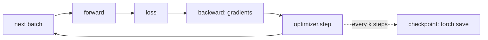
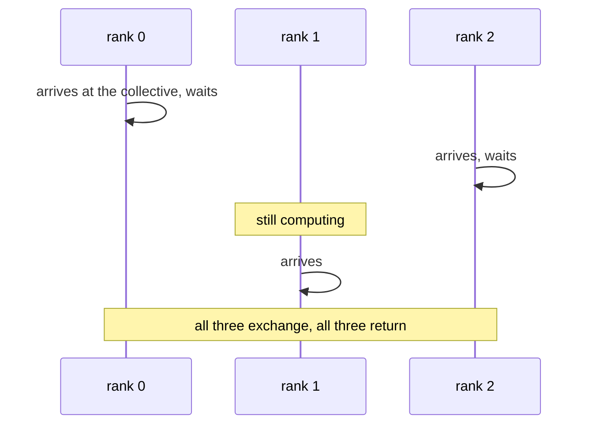
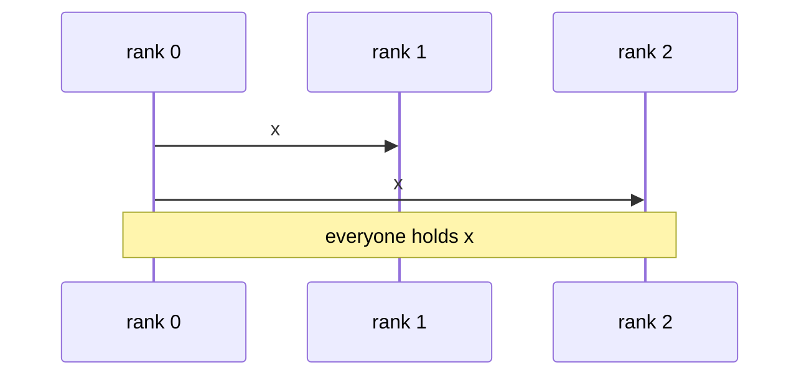
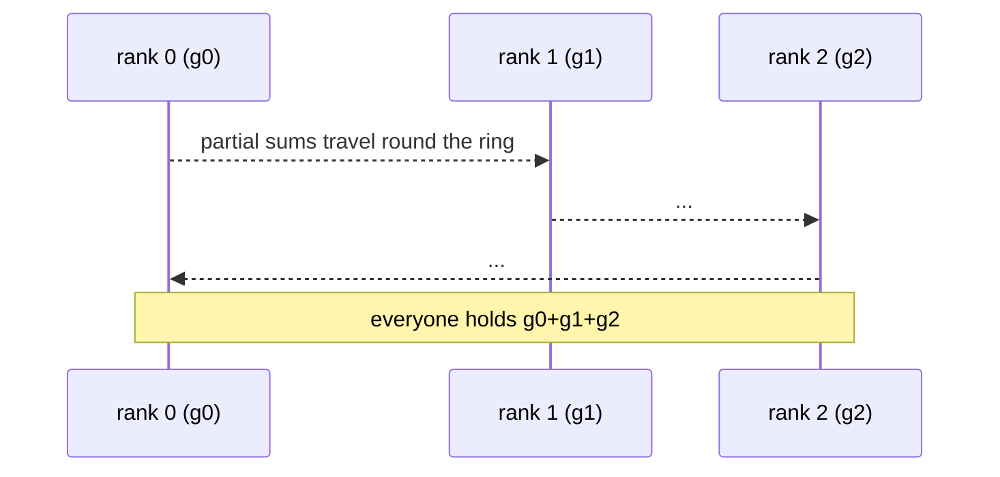
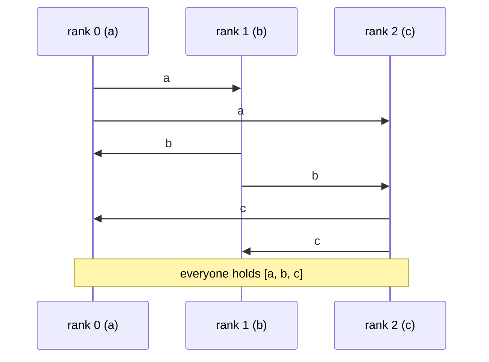

# Collectives: the primitives every distributed training is built from

For a reader who knows the training loop on one machine and is about to read
`docs/parallelism.md`, which explains the kinds of parallel training in terms of these
primitives and says where distrainer fits.

## 1. The loop on one machine

One process, one model, one optimizer. The batch comes from a loader, the checkpoint is a
file. Nothing waits for anything.

## 2. What changes with several processes

Run that loop `N` times at once, one process per GPU (or per CPU worker). Each copy is a
**rank**: an integer `0..N-1`, its own process, its own memory, its own device. Ranks share
nothing by default. Every way of training on several devices is a decision about what the
ranks must *agree on* and *when*:

- the same weights everywhere (data parallelism), or one piece of the weights each (sharded
  or tensor parallelism), or one piece of the network each (pipeline parallelism);
- different data per rank (almost always), and a way of knowing who had what.

The agreement happens through **collectives**: calls that every rank of a group makes with a
tensor, and that return on every rank only once all of them have called. That last clause is
the whole subject. A collective is a meeting: the first to arrive waits for the last; a rank
that never arrives hangs everyone else forever. That is the distributed hang, and its usual
cause is a collective inside an `if rank == 0:`.

Every collective is therefore also a **barrier**, whether or not it moves data. When a loop
is read for correctness, the question is always: does every rank reach the same sequence of
collectives, in the same order, with tensors of the same shape? If yes, the loop cannot hang
and the ranks cannot drift.

## 3. The primitives

The **process group** is the set of ranks that take part, with a backend that moves the
bytes: NCCL between GPUs (over NVLink inside a machine, over the network between machines),
Gloo between CPUs. Sub-groups exist so that a collective can involve only some ranks (the
GPUs of one machine, say). Every primitive below takes a group; "all ranks" means the group.

### barrier

No data. Everyone waits for everyone. Used to fence a phase: "nobody starts the next segment
until every rank has finished this one".

### broadcast

One rank's tensor becomes everyone's. Used once at start so every replica begins with the
same weights, and for small decisions one rank makes that all must follow.

### all-reduce

Every rank contributes a tensor of the same shape; every rank receives the element-wise sum
(or mean, max). The workhorse of data parallelism: gradients in, averaged gradients out, so
every replica takes the same optimizer step.

Cost: a ring all-reduce sends each rank about twice the tensor's size over the network no
matter how many ranks there are, so large tensors are bandwidth-bound and small ones are
latency-bound (a few round trips). Two collectives per step over a transatlantic 100 Mbps
link cost distrainer 2.5 s per step on RunPod; the same step took 0.15 s alone.

### all-gather

Every rank contributes a tensor; every rank receives all of them, concatenated. Used when a
rank needs to *see* what the others have without summing it: the other ranks' positives as
extra negatives in a contrastive loss (distrainer's `all_gather` in `info_nce`), or the other
shards of a parameter before using it (sharded data parallelism).

### reduce-scatter

The sum of everyone's tensors, but each rank keeps only its own slice of the result. It is
the first half of a ring all-reduce (an all-reduce is a reduce-scatter followed by an
all-gather), and it is what sharded data parallelism does with gradients: after the sum,
rank `r` keeps the gradient of the parameters it owns.

### scatter and gather

Rank 0 hands each rank a slice, or collects a slice from each. Rare inside training loops
(too centralised); common for assembling a full checkpoint on one rank.

### send and receive

Point to point, between two ranks, no group. Pipeline parallelism is made of these: stage
`s` sends its activations to stage `s+1` in the forward pass and receives gradients from it
in the backward pass. A send without a matching receive hangs like any collective.

## 4. Where they appear in distrainer's loop

| moment in `train_loop` | primitive | who | why |
|---|---|---|---|
| start of an attempt | broadcast from rank 0 | all | every rank uses the same attempt id in its audit records |
| inside `train_step`, in `backward()` | all-reduce (implicit, by DDP) | all | the gradients averaged, so the replicas stay identical |
| inside `info_nce` with `all_gather: true` | all-gather | all | each anchor also sees the other ranks' positives as negatives |
| every `ray.train.report` | barrier (and a checkpoint rides along from rank 0) | all | the policy decides on every rank identically, so every rank reports at the same steps |
| after the segment-end hooks | barrier | all | nobody reads the next segment before rank 0 has finished writing it |

The loop is safe because those calls happen at the same steps on every rank: the dealer gives
every rank exactly `W / n` blocks per segment, and the checkpoint policy sees the same step
counter everywhere. The two things a user writes, `build_model` and `train_step`, must keep
that property: no collective inside a branch that only some ranks take.

Next: `docs/parallelism.md`.
