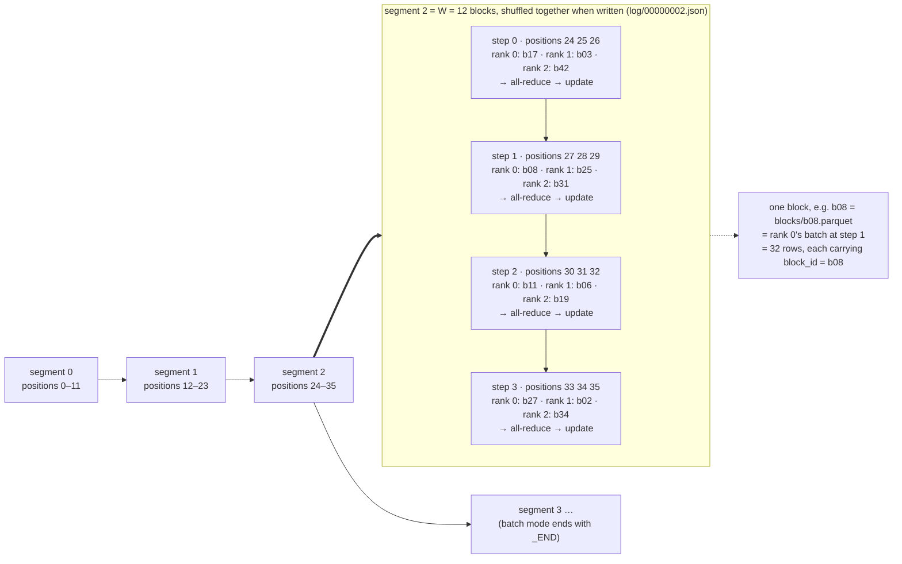

# distrainer — design sketch: block-native distributed training on OSS Ray

*Draft, September 9, 2026. Companion to `ray-sub-epoch-training-report.md`. Superseded in detail by `distrainer-spec.md` (rev 2).*

> **Revision note (rev 2 of the spec).** The "Planner / BlockStore namespaces" described below were replaced by a single **block log**: an append-only sequence of immutable *segments*, each a file listing `W` blocks in already-shuffled order, stored next to the block Parquet files on a local folder or S3. The writer (batch: everything at t=0; streaming: as blocks arrive; the re-mining hook is a writer too) is the only process that appends; the trainer only reads, and waits at the end of the log if the next segment is not there yet. Batch and streaming ingest therefore share one code path, the ledger becomes `(segment, cursor, world_size)`, and "chunk" is now called "segment". In plain words: the log is the ordered list of batches to train on, written in shuffled groups; the trainer walks it and remembers only how far it got. See spec sections 2–5.
>
> The unit hierarchy with the spec's worked example (`W = 12`, three workers):

## Goal

An open-source trainer on Ray Train v2 that offers configurable checkpointing anywhere between one batch and one epoch, row-exact resumption after failure or preemption, elastic world size, and explicit control over batch composition (e.g. hard-negative batches for contrastive training) — functionally comparable to Anyscale's mid-epoch resumption, without relying on the Anyscale runtime.

## Core idea

Make the **block** the unit of composition, shuffling, dispatch, compute, and progress accounting. Progress is then "which blocks are done", which is independent of world size and of any per-rank iterator position. OSS Ray Data has no resumable iterator state; this design removes the need for one.

## Components

**Block.** A designed set of rows with a stable `block_id` and a locator (Parquet file or row group per block; or a list of `row_id`s into a materialized store). Produced by a mining/preprocessing pass (Ray Data `map_batches` / `groupby().map_groups()`), written to a `BlockStore`. A block may be a single GPU batch or a super-batch that the worker micro-batches with gradient accumulation.

**BlockStore.** Read/write of blocks by id. Simplest backing: one Parquet file per block under `store/<epoch>/<chunk>/<block_id>.parquet`, plus an index file listing block ids and row counts.

**Planner.** `plan(epoch, chunk) -> List[block_id]`: a seeded permutation of the chunk's blocks (`seed, epoch, chunk` → deterministic order). Shuffle therefore happens at block granularity. Adjacent positions may be chosen deliberately so that the `n` blocks consumed in one global step are related (e.g. mutually hard negatives for an `all_gather` loss). Chunk boundaries are where re-mining or re-shuffling happens; chunk size is a config knob (K blocks, or a whole epoch).

**Assignment rule.** Plan position `i` goes to rank `i mod n` at global step `i div n`. Deterministic, and trivially re-dealt when `n` changes.

**Ledger.** The data state stored in every checkpoint: `{"epoch": e, "chunk": c, "cursor": k}` where `k` is the number of completed global steps. Because `ray.train.report` is a barrier that all ranks call the same number of times, every rank is at the same step at every checkpoint, so one integer captures the data position. Resume = rebuild `plan(e, c)` from the same seed, start at position `k * n_old`, re-deal the tail over the current `n`. Blocks between the last checkpoint and the failure are replayed (same guarantee as Anyscale: resume from last checkpoint).

**CheckpointPolicy.** `should_checkpoint(step, block_id, chunk_end, epoch_end, elapsed) -> bool`. Built-ins: every K global steps, chunk end, epoch end, time budget. Index-based policies need no communication. Time-based policies must be decided by rank 0 and broadcast (`ray.train.collective.broadcast_from_rank_zero`) every M steps so `report` counts stay identical across ranks. Uploads use `CheckpointUploadMode.ASYNC` when cadence is tight; `CheckpointConfig(num_to_keep=...)` for retention. Checkpoint dir = model/optimizer state + `ledger.json`.

**Ingest backends (same plan, two implementations).**

- *A. Ray Data streaming.* `ray.data.from_items(plan_tail).map_batches(load_block, batch_size=1)` so each output block is exactly one designed block; iterate with `iter_torch_batches(batch_size=None)`; set `DataContext.execution_options.preserve_order = True` so the `OutputSplitter` min-rows dispatch becomes round-robin and matches the assignment rule (verify with a test). Either pass the dataset to `TorchTrainer(datasets=...)` per chunk, or have rank 0 call `streaming_split(n, equal=True)` inside `train_func` and distribute the picklable iterators with `broadcast_from_rank_zero`. Pros: parallel loading, backpressure. Cons: `preserve_order` disables locality hints (blocks move through the object store), lockstep epoch barrier.
- *B. Per-rank lane loader.* Rank `r` takes `plan[r::n]` and loads blocks from the `BlockStore` in a prefetch thread pool (DataLoader-style). No coordinator, no lockstep beyond `report`, perfect locality, trivially elastic. Ray Data is used only for mining/preprocessing. Recommended first implementation.

**Trainer wrapper.** `DistTrainer(train_step, planner, store, policy, backend, scaling_config, failure_config)` wraps `TorchTrainer`. Inside `train_func`: load checkpoint → ledger → plan tail → iterate blocks → `train_step(model, block)` (micro-batching inside) → `policy` → `report(metrics, checkpoint)` from rank 0 (or per-rank shards for FSDP). Uses `FailureConfig(max_failures, max_preemption_failures)` and `ScalingConfig(num_workers=(min, max))`.

**Chunk hooks.** `on_chunk_end(model, ledger) -> None | new blocks`. Typical use: embed corpus with current weights (Ray Data `map_batches` on GPU actors, driven from rank 0 or a side job), mine hard negatives, write new blocks, and the Planner emits the next chunk. With backend B this is a new lane per rank; with backend A a new chunk dataset (or a driver loop of `TorchTrainer(datasets={"train": factory}, resume_from_checkpoint=...)` per chunk at the cost of worker-group startup).

## Properties

- Checkpoint cadence: any block boundary → epoch, index- or time-based.
- Resume: row-exact at block granularity; no per-rank iterator state.
- Elasticity: re-deal plan tail over new world size; cursor unchanged.
- Composition: blocks are designed upstream; shuffle is a seeded block permutation; per-step cross-rank structure via plan adjacency.
- Communication: data moves per block to one worker; loss-side `all_gather` for cross-device negatives is orthogonal.
- Constraint: data must be pre-blocked; pipelines with shuffles/joins between load and train do not fit. Fine for designed-batch training.

## Open decisions

- Backend B first, A as optional? (Recommendation: yes.)
- Block format: one Parquet file per block vs. row groups within larger files (fewer objects, needs row-group-level reads).
- Where mining runs: rank 0 inside the run vs. a separate Ray job writing to the store and signalling via the index file.
- Time-based policy consensus interval M.
- Whether to keep a small `ledger.json` in shared storage outside the Train checkpoint for observability.

## First tests to write

1. Backend A: with `preserve_order=True` and uniform blocks, rank `r` step `k` receives plan position `k*n + r`.
2. Kill a worker mid-chunk with `max_failures=1`; assert the union of consumed block ids after recovery equals the plan, with replay confined to blocks after the last checkpoint.
3. Resize from n=4 to n=3 mid-chunk; assert the same.
4. Checkpoint every K blocks with ASYNC upload; assert `report` counts match on all ranks.
