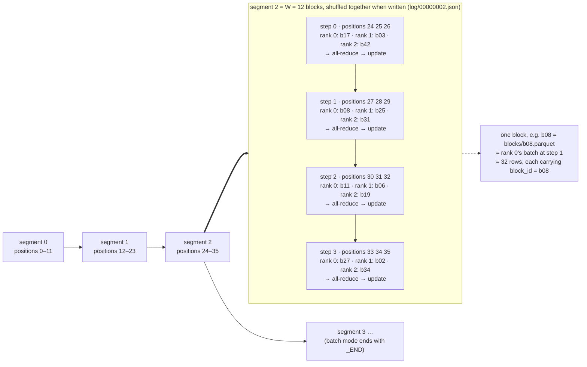
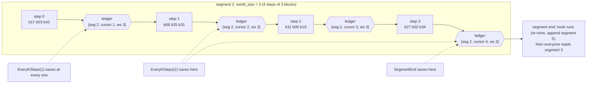
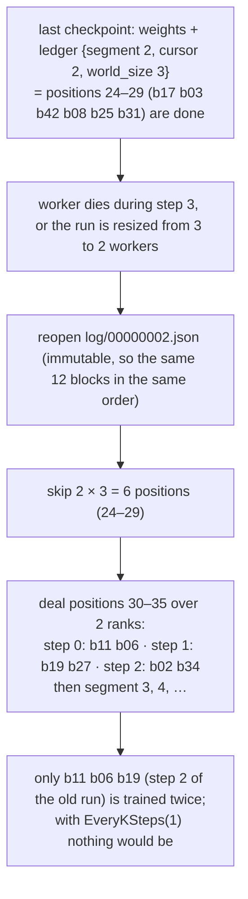

# distrainer — specification v0.1

*September 9, 2026 (rev 2: block log replaces the namespace/plan store); rev 3, September 13, 2026: decisions recorded before implementation started, see section 15. Supersedes the sketch in `docs/distrainer-design.md` where they differ. Target: Ray 2.58 (Train v2 default-on), PyTorch CPU build for local testing, Python 3.13 with `requires-python >= 3.11`.*

## 1. Scope

distrainer is an open-source library on top of Ray Train v2 that provides:

- **Block-native data ingest.** The unit of composition, shuffle, dispatch, compute, and progress accounting is a *block*: a pre-built set of rows with a stable id (e.g. one contrastive batch with its hard negatives).
- **Configurable checkpoint cadence** from one block to one epoch, plus segment and pass boundaries.
- **Row-exact resumption** after worker failure, node loss, or preemption, at block granularity, without per-rank iterator state.
- **Elastic world size** using `ScalingConfig(num_workers=(min, max))`, with progress that survives resizes.
- **Segment hooks** for sub-epoch work such as hard-negative re-mining, and a **block log** that makes batch and streaming ingest the same code path.

v0.1 implements the **per-rank lane loader** ("backend B"). The Ray Data streaming backend ("backend A") is out of scope for v0.1 but the interfaces leave room for it.

Non-goals for v0.1: model-parallel checkpoint merging (FSDP/DeepSpeed shards) beyond what `ray.train.report` already supports; job-driver (head node) fault tolerance; GPU-specific paths (everything must run on CPU for local tests, GPU is a config flag).

## 2. Concepts and invariants

### 2.1 Plain-language summary

Everything in distrainer is built from one idea: training data is a **log of blocks**. A block is one batch that somebody already put together (for example an anchor, its positive, and its hard negatives). Blocks are appended to a log in the order they become available, in groups called **segments**. Batch training and streaming training are the same thing to distrainer: in batch mode the whole log is written before training starts; in streaming mode it keeps growing while training runs. The trainer only ever *reads* the log, so the reading code is identical in both cases.

The unit hierarchy, smallest to largest:

- a **row** is one training example;
- a **block** is one rank's batch, stored as one Parquet file; the row → block association is simply which file the row is in;
- a **step** is `world_size` blocks, one per rank, ending in the gradient all-reduce and one optimizer update;
- a **segment** is a fixed number of blocks that were shuffled amongst each other when written; that number is called `W` (window) throughout this spec, is set once per log, and is typically a few hundred; it is the sub-epoch unit where hooks (re-mining), re-shuffling, and segment-end checkpoints happen. "Chunk" and "segment" mean the same thing; this document says segment;
- the **log** is the ordered sequence of segments: the whole dataset in batch mode, the stream so far in streaming mode.

Progress is one number: how many steps of the current segment are done. Because every rank finishes a step at the same moment (the all-reduce and `report` are barriers), that single number describes the data position for the whole world, and it stays valid when the number of workers changes.

Worked example used throughout this spec: `W = 12` blocks per segment, `world_size = 3` workers (written `n` in formulas below), blocks of 32 rows. Segment 2 holds positions 24–35 and is four steps long.



**Reading the diagram.** The bottom row is the log: segments 0, 1, 2, … in the order the writer committed them, each owning twelve consecutive positions. Segment 2 is opened up in the box: its twelve blocks are already in their shuffled order, and they are consumed three at a time, one per rank, as steps 0 to 3. Each step ends with the gradient all-reduce and one weight update, so there are exactly four updates per segment with three workers. The dotted arrow picks out one block, `b08`: it is position 27, it is rank 0's batch at step 1, and on disk it is a single Parquet file of 32 rows that all carry `block_id = b08`. Nothing about the model is communicated at the segment boundary; that boundary is only where the data ingredients may change and where a hook may run.

Every step boundary is a legal checkpoint; the policy chooses which ones to use. Ledger values a checkpoint would carry at each boundary of segment 2:



**Reading the diagram.** Time runs left to right through segment 2. After each step every rank has finished the same block, so each of the four hexagons is a legal place to write a checkpoint, and the ledger value shown is exactly what that checkpoint would record: the segment, how many steps of it are done (`cursor`), and the world size (abbreviated `ws` in the picture). The dashed arrows show which of those boundaries three different policies would choose: `EveryKSteps(1)` saves at every hexagon, `EveryKSteps(2)` at the second and fourth, `SegmentEnd` only at the fourth. With `Any([EveryKSteps(2), SegmentEnd])` you get the union. After the last step the segment hook runs on rank 0 (for example re-mining and appending segment 3) while the other ranks wait, and then everyone moves on to segment 3.

Resume from the checkpoint taken after step 1 (`{segment 2, cursor 2, world_size 3}`), including a resize from 3 to 2 workers:



**Reading the diagram.** The run last checkpointed after step 1 of segment 2, so the ledger says `cursor 2` with `world_size 3`: six positions, 24 to 29, are done. Then something interrupts the run during step 3 (a worker dies, or the world is resized from three workers to two). On restart the trainer reopens the same segment file, which cannot have changed, skips the six finished positions, and deals the remaining six over the two ranks that exist now: three steps instead of two. The blocks of old step 2 (`b11 b06 b19`) had been trained on but not yet checkpointed, so they are trained a second time; that replay is the whole cost of the failure, and a tighter checkpoint policy makes it smaller. (In the general case the resume rule rounds the finished-position count down to a multiple of the new world size; here 6 is already a multiple of 2, so nothing extra is replayed.)

### 2.2 Definitions

**Block** — `BlockRef(block_id: str, locator: str, num_rows: int, meta: dict)`. `locator` names one Parquet file under `store/blocks/`. Every row in the file carries its `block_id` (and a `row_id` if the producer has one). Block contents are otherwise opaque to distrainer; the user's `train_step` interprets columns.

**Segment** — an immutable file `store/log/<seq:08d>.json` listing exactly `W` block entries in final (already shuffled) order, plus small metadata (`seq`, `W`, `seed`, `pass`, `created_at`, producer notes). `W` is fixed per log and must be a multiple of every world size the run may use. Segment `seq` covers global positions `[seq*W, (seq+1)*W)`.

**Log** — the ordered set of segments plus an optional `store/log/_END` marker meaning "the producer is finished". A reader that reaches the end of the last segment and finds no `_END` waits for the next segment (streaming); if `_END` is present the run is complete.

**Writer** — the single process allowed to append segments to a log. It buffers `W` blocks, permutes them with `random.Random(hash((seed, seq)))`, writes the block files, then commits the segment file atomically (temp name + rename locally; single `put` on S3). Batch mode = a writer that emits the whole corpus at t=0, one `pass` per epoch: for each pass it first permutes the *entire* block list with `Random(hash((seed, pass)))` and only then cuts it into segments of `W`, so both segment membership and within-segment order change from pass to pass (positions keep counting up across passes). Streaming mode = a writer that runs alongside training; segment membership is then decided by arrival order, and a writer may hold a **shuffle buffer** of `k*W` blocks and commit each segment by sampling `W` of them to mix beyond the window (config `log.shuffle_buffer_segments`, default 1). The re-mining hook is a writer too.

**Segments are always complete before they are trained on.** A segment file is written only after all of its `W` block files exist, in one atomic operation, and the trainer reads only committed segment files. So in both modes the segment being trained on is fully known, which is what makes resume well defined: the ledger names a segment and a cursor, the segment file cannot have changed, and the blocks it names are retained until a later checkpoint exists. The writer therefore needs to be exactly one segment ahead of the trainer, never more; `W` is also the streaming latency (the trainer cannot start a segment until `W` blocks have arrived), so streaming logs typically use a smaller `W` than batch logs. If a writer crashes mid-segment, block files not referenced from any committed segment are orphans: ignored by readers and removed by `gc`.

**Assignment rule** — with `n = world_size`, global position `p` is consumed by rank `p mod n` at step `p // n` within its segment. Since `W` is a multiple of `n`, every rank takes `W/n` steps per segment and nothing is dropped. (v0.1 does not allow partial segments: a segment file always lists exactly `W` blocks, and `BatchWriter`/`StreamingWriter` handle a corpus that is not a multiple of `W` with an explicit tail policy, `error` (default), `drop`, or `wrap`.)

**Step** — one block per rank, all ranks, ending in the all-reduce + optimizer update, followed by `ray.train.report` (a barrier).

**Ledger** — `Ledger(segment, cursor, world_size)`: `cursor` = completed steps within `segment`; `world_size` = `n` when the checkpoint was written. Saved in every checkpoint as `ledger.json`. Invariant: at any checkpoint all ranks have consumed exactly positions `[segment*W, segment*W + cursor*n)`.

**Resume rule** — read segment `segment` from the log, skip `cursor * world_size_old` positions, re-deal the rest (and all later segments) over the current `n` with the assignment rule. Positions between the last checkpoint and the failure are replayed; the window is bounded by the checkpoint cadence. Requires retention: a segment and its blocks may only be deleted once a checkpoint with a later `segment` exists (plus a configurable margin of segments).

**Audit trail** — every consumed block is appended as `{"attempt", "rank", "world_size", "segment", "step", "position", "block_id", "ts"}` to `<store_root>/audit/<run_name>/<attempt>-<rank>.jsonl`; `attempt` is one more than the highest attempt already on disk (rank 0 decides, broadcast), so every restart, even from the same checkpoint, has its own files (on object stores the file is split into `<attempt>-<rank>.<part>.jsonl` parts). Records are ordered by file order within a rank, never by `ts`. This is what the verification harness reads.

## 3. Package layout

```
distrainer/
  __init__.py
  block.py        # BlockRef, Parquet read/write helpers (pyarrow + fsspec)
  log.py          # BlockLog: the segment log (reader: list/wait/read; writer: buffer/shuffle/commit; retention)
  planner.py      # Dealer: positions -> lanes; SegmentCursor helpers (pure functions over the ledger)
  ledger.py       # Ledger dataclass, (de)serialization, resume arithmetic
  policy.py       # CheckpointPolicy protocol + EveryKSteps, SegmentEnd, PassEnd, TimeBudget, Any([...])
  loader.py       # LaneLoader: per-rank prefetching iterator over a lane of BlockRefs
  hooks.py        # SegmentHook protocol (on_segment_end); hooks are writers
  writer.py       # BatchWriter (corpus -> segments at t=0), helper base for streaming writers
  trainer.py      # DistTrainer: wraps TorchTrainer, owns train_func
  audit.py        # audit-log writer/reader
  storage.py      # build (pyarrow fs, root) from config.storage: local folder (default) or S3-compatible (MinIO, R2)
  config.py       # DistrainerConfig (dataclasses), YAML loading
  cli.py          # inspect / resume / export / log-ls / gc
examples/
  hello_blocks/        # smallest possible use of the API: linear-regression blocks, DDP, checkpoint + resume; `just smoke`
    make_blocks.py
    train.py
    local.yaml
  streaming_producer/  # a writer process that appends segments with sleeps, for S11 (M4)
    produce.py
  toy_contrastive/     # the full toy workload of section 8; `just contrastive`
    make_blocks.py     # synthetic clustered data -> blocks with hard negatives -> BatchWriter (uses Ray Data)
    model.py           # tiny MLP encoder + InfoNCE with optional all_gather
    train.py           # DistTrainer entrypoint
    remine.py          # SegmentHook: re-embed, mine, write the next segment
tests/                 # focused unit tests: log commit/discover, dealer determinism, ledger arithmetic, policy, loader
regression_tests/      # bug / API regression tests (added as bugs are found)
integration_tests/
  cluster/             # scenario runner that drives the cluster through deploy/driver.sh verbs and checks audit logs (S1–S11)
deploy/
  driver.sh            # cluster-driver verb interface (up N, down, exec-head, kill-worker I, scale N, cp-from-head, endpoint)
  drivers/compose.sh   # docker compose on OrbStack (the only implemented driver in v0.1)
  drivers/uncloud.sh   # stub with the same verbs for uncloud (`uc deploy`, `uc scale`, `uc exec`), filled in when machines exist
  Dockerfile
  docker-compose.yml
  ray-head.sh, ray-worker.sh
  k8s/                 # phase 2: KubeRay manifests (driver kuberay)
docs/                  # introduction, this spec, design, research report, gest_codex_workflow.md
AGENTS.md              # from agent_gest_git_skills AGENTS.template.md, project section filled in
CLAUDE.md              # adapter pointing at AGENTS.md / .agents/skills
.agents/skills/        # vendored g* skills (installed, not hand-edited)
Justfile               # python-uv command contract + harness targets (section 14)
pyproject.toml         # uv-managed; ruff, ty, pytest
```

### 3.1 Store layout (local folder or S3 prefix)

```
<store_root>/
  blocks/<block_id>.parquet        # one block per file; rows carry block_id (+ row_id)
  log/00000000.json                # segment 0: W entries in final order + metadata
  log/00000001.json
  log/00000001.rows.parquet        # optional reverse index (row_id, block_id) for this segment
  log/_END                         # optional: producer finished (batch mode writes it immediately)
  log/_meta.json                   # {"W": 256, "seed": 1234, "created_by": ..., "schema_version": 1}
```

Commit protocol: block files first, then the segment file. A reader only trusts blocks referenced from a committed segment. Segment numbers are contiguous; the reader's discovery is "does `log/<next>.json` exist?" (one `exists` call, not a listing, once the reader knows where it is). Local: write `<file>.tmp-<uuid>` next to the target then `os.replace` (readers ignore `.tmp-*` names). S3: a single `put_object` is atomic and strongly consistent. The within-segment permutation uses `random.Random(hash((seed, seq)))`; `hash` of an int tuple does not depend on `PYTHONHASHSEED` and is stable across CPython 3.11–3.13, and because the permutation is materialised in the immutable segment file, resume never recomputes it.

## 4. Interfaces

```python
# block.py
@dataclass(frozen=True)
class BlockRef:
    block_id: str
    locator: str          # path relative to store root, e.g. "blocks/b000017.parquet"
    num_rows: int
    meta: dict = field(default_factory=dict)

def read_block(fs, root: str, ref: BlockRef) -> pyarrow.Table: ...
def write_block(fs, root: str, block_id: str, table: pyarrow.Table, meta: dict | None = None) -> BlockRef: ...

# log.py
@dataclass(frozen=True)
class Segment:
    seq: int
    W: int
    seed: int
    pass_idx: int                      # which pass over the corpus (batch mode); 0 in pure streaming
    blocks: list[BlockRef]             # exactly W entries, final order
    meta: dict
    def positions(self) -> range: return range(self.seq * self.W, (self.seq + 1) * self.W)

class BlockLog:
    """The segment log. Readers and writers share this class; only one writer per log."""
    def __init__(self, fs: pyarrow.fs.FileSystem, root: str): ...
    # reader side
    def meta(self) -> LogMeta                                   # W, seed, schema_version
    def read_segment(self, seq: int) -> Segment
    def has_segment(self, seq: int) -> bool
    def ended(self) -> bool                                     # _END present
    def wait_segment(self, seq: int, poll_s: float = 1.0, timeout_s: float | None = None) -> Segment | None
        # returns None only if ended() and seq does not exist
    def last_seq(self) -> int | None                            # highest committed segment (listing)
    # writer side
    def append(self, blocks: list[BlockRef], *, pass_idx: int = 0, meta: dict | None = None,
               verify_blocks: bool = True) -> Segment
        # requires len(blocks) == W; verify_blocks reads every Parquet footer first; shuffles with
        # Random(hash((seed, seq))); commits atomically; refuses to overwrite a committed seq
    def end(self) -> None                                       # write _END
    # retention
    def gc(self, keep_from_seq: int, delete_blocks: bool = True) -> list[int]
        # delete segments < keep_from_seq and (delete_blocks) the block files no kept segment
        # references; the trainer calls it on rank 0 at segment ends when log.gc is set, with
        # keep_from_seq = segment of the last checkpoint rank 0 saved - log.retention_segments

# planner.py  (pure functions; no I/O)
def lane(segment: Segment, rank: int, world_size: int, start_step: int = 0) -> list[tuple[int, BlockRef]]:
    """Positions/blocks this rank consumes in this segment, starting at step start_step."""
    W = segment.W; assert W % world_size == 0
    out = []
    for step in range(start_step, W // world_size):
        p = step * world_size + rank
        out.append((segment.seq * W + p, segment.blocks[p]))
    return out

def resume_start(ledger: "Ledger", world_size_now: int) -> tuple[int, int]:
    """(segment, start_step) for the current world size: positions before
    ledger.segment*W + ledger.cursor*ledger.world_size are done."""
    done = ledger.cursor * ledger.world_size
    assert done % world_size_now == 0 or ledger.world_size == world_size_now  # see note below
    return ledger.segment, done // world_size_now

# ledger.py
@dataclass
class Ledger:
    segment: int = 0
    cursor: int = 0          # completed steps in this segment
    world_size: int = 0      # n at the time of the checkpoint
    pass_idx: int = 0        # copied from the segment, for hooks/policies that care about passes
    def done_positions(self) -> int: return self.cursor * self.world_size
    def save(self, dir: str) -> None; @classmethod def load(cls, dir: str) -> "Ledger"

# policy.py
class CheckpointPolicy(Protocol):
    def should_checkpoint(self, ctx: StepContext) -> bool
    # StepContext: position, step_in_segment, segment_end: bool, pass_end: bool, elapsed_s, rank

EveryKSteps(k)             # index-based, no communication
SegmentEnd(); PassEnd()
TimeBudget(seconds, poll_every=M)   # rank 0 decides; broadcast_from_rank_zero every M steps
Any(policies)              # OR-combination

# loader.py
class LaneLoader:
    """Prefetching iterator; yields (segment, (position, BlockRef, pyarrow.Table)) in lane order.
    `lanes` yields (segment, lane) pairs (see section 5) or is a callable taking the loader's
    stop Event, so a blocking wait_segment inside it can be interrupted by close(). A producer
    thread walks the lanes so prefetch continues across segment boundaries. Iterate once."""
    def __init__(self, fs, root, lanes, prefetch: int = 2, threads: int = 2): ...
    def __iter__(self): ...
    def close(self): ...

# hooks.py
class SegmentHook(Protocol):
    def on_segment_end(self, model, ledger: Ledger, log: BlockLog, ctx: TrainInfo) -> None
    # runs on rank 0 while others wait at a barrier; may log.append(...) the next segment(s).
    # model is the unwrapped module, ledger a snapshot, log a BlockLog of rank 0's own (not the
    # loader's reader instance), ctx the TrainInfo of the step just completed.
def build_hooks(cfg: DistrainerConfig) -> list[SegmentHook]
    # cfg.hooks = {name: {entry: "pkg.module:factory", ...args}} (or {name: "pkg.module:factory"});
    # factory(cfg, **args) -> SegmentHook, called on rank 0 inside the worker, config order
def load_entry(entry: str) -> Any                             # "pkg.module:attr", also used by the CLI

# writer.py
class BatchWriter:
    """Turn a finished corpus of blocks into a log. For each pass p: globally permute all N blocks with
    Random(hash((seed, p))), cut into ceil(N/W) segments, append each (within-segment order is then
    re-shuffled by BlockLog.append). Segment membership therefore differs between passes."""
    def __init__(self, log: BlockLog, blocks: list[BlockRef], passes: int = 1): ...
    def run(self) -> None      # append(...) for each segment, then end()

# trainer.py
class DistTrainer:
    def __init__(self, train_step, build_model, log: BlockLog, policy,
                 config: DistrainerConfig, hooks: list[SegmentHook] = (),
                 scaling_config: ScalingConfig, run_config: RunConfig): ...
    def fit(self) -> ray.train.Result
# train_step(model, optimizer, table: pyarrow.Table, ctx) -> dict[str, float]   (user-provided; micro-batching inside)
# build_model(ctx) -> (model, optimizer)                                            (user-provided)
```

Note on `resume_start`: `done = cursor * n_old` positions are complete. Because `W` is a multiple of every allowed world size and checkpoints are only written at step boundaries, `done` is a multiple of `n_old`; it is a multiple of `n_new` too when both divide `W` and `done` is a multiple of `lcm(n_old, n_new)`. To keep the arithmetic trivial, the resume rule rounds *down* to the last position that is a multiple of `n_new` and replays the remainder (at most `n_new - 1` blocks). The audit checks account for this.

## 5. Training loop (inside `train_func`, every rank)

```
ctx      = ray.train.get_context(); rank, n = ctx.get_world_rank(), ctx.get_world_size()
model, opt = build_model(ctx); wrap with ray.train.torch.prepare_model
log      = BlockLog(fs, cfg.store_root); W = log.meta().W; assert W % n == 0
ledger   = Ledger()
ckpt     = ray.train.get_checkpoint()
if ckpt: load model/opt state; ledger = Ledger.load(ckpt_dir)
seq, start_step = resume_start(ledger, n)

def lanes():                                   # generator consumed by LaneLoader (prefetch spans segments)
    s, first = seq, start_step
    while (segment := log.wait_segment(s)) is not None:
        yield segment, lane(segment, rank, n, first)
        s, first = s + 1, 0

loader = LaneLoader(fs, cfg.store_root, lanes())
for segment, (position, ref, table) in loader:
    if segment.seq != ledger.segment: ledger.segment, ledger.cursor, ledger.pass_idx = segment.seq, 0, segment.pass_idx
    metrics = train_step(model, opt, table, ctx)          # forward, backward, all-reduce, optimizer step
    audit.append(rank, n, segment.seq, ledger.cursor, position, ref.block_id)
    ledger.cursor += 1; ledger.world_size = n
    segment_end = (ledger.cursor == W // n)
    pass_end    = segment_end and log.next_pass_differs(segment)    # or ended()
    if policy.should_checkpoint(StepContext(position, ledger.cursor, segment_end, pass_end, ...)):
        report(metrics, checkpoint=save(model, opt, ledger) if rank == 0 else None,
               checkpoint_upload_mode=ASYNC)
    else:
        report(metrics)                                    # keeps report counts aligned
    if segment_end:
        if rank == 0:
            for h in hooks: h.on_segment_end(unwrap(model), copy(ledger), hook_log, ctx)   # may append next segment
            if cfg.log.gc: hook_log.gc(last_ckpt_segment - cfg.log.retention_segments, cfg.log.gc_blocks)
        ray.train.collective.barrier()
loader.close()
```

Notes: in Ray Train v2 `report` is not a cheap RPC: each worker has a one-slot result queue that the controller drains only every `RAY_TRAIN_HEALTH_CHECK_INTERVAL_S` (2 s by default), so a `report` per step caps training at about one step per poll interval regardless of model size (measured: 480 tiny steps took 8.5 minutes at 8% CPU). The loop therefore calls `report` only at the steps where the policy takes a checkpoint (every policy decides identically on all ranks: index-based ones by construction, `TimeBudget` through a broadcast), averages the numeric metrics of the steps in between (`<key>_mean`, `steps_in_report`), and issues one final metrics-only `report` if the last step was not a checkpoint; all ranks still call `report` the same number of times. `checkpoint.report_every_step: true` restores a report per step for debugging, and `ray_health_check_interval_s` (default 0.5) lowers the controller poll interval through the job runtime env in `distrainer.trainer.init_ray`. The checkpoint directory is a non-temporary dir (ASYNC upload requirement). Rank 0 saves the ledger *after* incrementing the cursor, so the ledger describes "steps completed including this one". Elastic resize or failure: Train restarts `train_func`; `resume_start` uses the ledger's old `world_size` and re-deals over the new `n`. In streaming mode `wait_segment` blocks all ranks equally at a segment boundary when the writer is behind (backpressure); the lane loader's prefetch across segments hides producer jitter when the writer is ahead. The hook runs *before* the barrier so the segment it appends is visible to `wait_segment` on every rank immediately after.

## 6. Checkpointing: where it happens, layout, storage, reconstitution

### 6.1 Who does what (Ray Train v2 mechanics)

- **The worker that calls `ray.train.report(checkpoint=...)` uploads.** `Checkpoint.from_directory(local_dir)` is a reference to a local directory; inside `report` the worker's train context copies that directory to `<storage_path>/<run_name>/<checkpoint_dir_name>/` with `pyarrow.fs.copy_files` (64 MB chunks; single-threaded for S3 uploads due to an Arrow issue). `SYNC` blocks the worker until the copy finishes; `ASYNC` copies in a per-worker thread (each `report` waits for the previous upload to finish); `NO_UPLOAD` skips the copy and trusts the `Checkpoint` you pass (use with `checkpoint_upload_fn` for custom uploaders). For DDP, rank 0 passes a checkpoint and other ranks pass `checkpoint=None`; for sharded states every rank passes its own directory and the files are merged into one checkpoint directory in storage.
- **The Train controller (on the head node) keeps the book.** Its `CheckpointManager` records every reported checkpoint with its metrics, enforces `CheckpointConfig(num_to_keep, checkpoint_score_attribute, checkpoint_score_order)` by deleting checkpoints from storage, and writes a JSON snapshot of its own state into the run directory so a restarted controller (`controller_failure_limit`) can continue. On worker-group restart it hands the latest checkpoint to workers via `ray.train.get_checkpoint()`.
- **Workers read.** `Checkpoint.to_directory(path)` downloads; `with checkpoint.as_directory() as d:` downloads to a temp dir (or yields the path directly when storage is local). `Checkpoint.get_metadata()` / `set_metadata(dict)` read/write a small JSON sidecar in the checkpoint directory without touching the payload.

Head container role: it hosts the Ray head, the Train controller, the driver (`train.py`), report generation over the audit logs, and the dashboard. It does not run a training worker (`ScalingConfig.resources_per_worker={"CPU": 1, "trainer": 1}` with workers started with `--resources='{"trainer": 1}'` and the head without).

### 6.2 Layout

```
<storage_path>/<run_name>/
  checkpoint_manager_snapshot.json         # Train's own bookkeeping (controller restarts)
  checkpoint_g{segment:06d}_p{positions:06d}_n{world_size:02d}_a{attempt:02d}/  # checkpoint_dir_name set by distrainer; positions = cursor*world_size, unique across resizes and attempts
    model.pt                               # state_dict (rank 0) or model_rank{r}.pt shards
    optimizer.pt
    ledger.json                            # {"segment","cursor","world_size","pass_idx","run_attempt"}
    .metadata.json                         # Checkpoint.set_metadata: ledger + distrainer version (cheap to read)
```

distrainer's `CheckpointIO.save(model, opt, ledger) -> Checkpoint` writes to a **non-temporary** local dir (`/tmp/distrainer/<run>/ckpt_<cursor>`, required for ASYNC), calls `set_metadata({"ledger": ledger.asdict(), "distrainer": __version__})`, and deletes local dirs older than the last two after upload (`delete_local_checkpoint_after_upload=True`). `CheckpointIO.load(checkpoint) -> (state, Ledger)` uses `as_directory()`.

### 6.3 Storage backends: local, S3, and S3-compatible

`RunConfig(storage_path, storage_filesystem)` accepts a URI that pyarrow resolves (`/shared/runs`, `s3://bucket/prefix`, `gs://…`) or an explicit `pyarrow.fs.FileSystem` plus a prefix-stripped path. Ray requires `fsspec` for the local case (installed with `ray[train]`).

For **S3-compatible** stores (MinIO in the harness, Cloudflare R2, Ceph RGW, etc.) pass an explicit filesystem so the endpoint is unambiguous:

```python
import pyarrow.fs as pafs
fs = pafs.S3FileSystem(
    access_key=os.environ["S3_ACCESS_KEY"], secret_key=os.environ["S3_SECRET_KEY"],
    endpoint_override=os.environ["S3_ENDPOINT"],   # e.g. "http://minio:9000" or "https://<acct>.r2.cloudflarestorage.com"
    scheme="http" if os.environ["S3_ENDPOINT"].startswith("http://") else "https",
    region=os.environ.get("S3_REGION", "auto"),
)
run_config = RunConfig(name=run_name, storage_path="distrainer/runs", storage_filesystem=fs, ...)
```

distrainer exposes this as `config.storage: {kind: local|s3, path, endpoint, region, access_key_env, secret_key_env}` and builds the filesystem once in `storage.py`; the same `(fs, root)` pair is used by `BlockStore` (blocks are Parquet, read/written with `pyarrow.parquet` on the same fs), by `CheckpointIO`, and by the audit writer. Every worker and the head must have the same credentials (compose `environment:` or a `.env`). Note that with S3 storage the run dir is no longer on a shared volume, so `Result.from_path` and the report generator take the same `fs`.

Worker-local scratch (`/tmp/distrainer`) is the only non-shared location; nothing else in the design assumes a shared POSIX volume, so the compose `shared:` volume becomes optional once MinIO is enabled (kept for the audit logs by default because it is convenient to `tail`).

### 6.4 Reconstitution

Three entry points, all built on `ray.train.Checkpoint(path, filesystem)`:

1. **Automatic** — worker failure, preemption, or elastic resize: Train restarts the worker group and `ray.train.get_checkpoint()` returns the latest reported checkpoint; `train_func` loads the ledger and resumes at `cursor * world_size_old` (section 5).
2. **Explicit, from a run** — `Result.from_path("<storage_path>/<run_name>", storage_filesystem=fs)` restores the `Result` (latest and best checkpoints, metrics); `DistTrainer(..., resume_from_checkpoint=result.checkpoint)` starts a *new* run (new `run_name`) from it. Ray Train v2 deprecated `TorchTrainer(resume_from_checkpoint=)`, so distrainer carries the checkpoint in the train loop config and loads it when `ray.train.get_checkpoint()` is empty. This is the path for driver/head loss and for "continue training tomorrow".
3. **Explicit, from a URI** — `Checkpoint("s3://bucket/distrainer/runs/toy/checkpoint_g000003_p000016_n02_a00", filesystem=fs)` (or a local path) → `resume_from_checkpoint=`. Works across runs, clusters, and world sizes because the ledger carries `world_size`.

CLI: `distrainer inspect <uri>` prints the ledger from `.metadata.json` without downloading weights; `distrainer resume <uri> --config cfg.yaml --entry pkg.module:function [--run-name] [--seed]` starts a new run from it (the entry function returns the user's `(train_step, build_model)` for the config); `distrainer export <uri> <local_dir>` = `to_directory`; `distrainer log-ls <store> [-v]` and `distrainer gc <store> --keep-from N` inspect and prune a block log. Example scripts accept `--set key.path=value` overrides so scenarios reuse one YAML. Reconstitution of the data position needs only the ledger plus the log (segment files are immutable, so `segment` + `cursor` + `world_size` identify the exact position), so no per-rank state is ever required.

Verification scenario **S9 — cold restore**: run S1 to completion against MinIO, `down -v` the cluster (destroying the shared volume), `up`, then `distrainer resume s3://…/checkpoint_g000003_p000016_n02_a00` for one more segment and assert the audit positions continue from `cursor * world_size`. **S10 — head loss**: `docker kill head` mid-run, `up` again, `Result.from_path` + resume; same assertion. (S11, streaming producer, is defined in section 10.)

## 7. Configuration

```yaml
run_name: toy
storage_path: /shared/runs     # checkpoints and Ray Train run state
store_root: /shared/blocks     # blocks, log, audit
seed: 1234
ray_address: auto              # null = local ray.init() (examples on a laptop)
ray_health_check_interval_s: 0.5   # Train v2 controller poll interval (default 2 s caps report rate)
storage:                       # the filesystem both paths live on (section 6.3)
  kind: local                  # local | s3; s3 adds endpoint, region, access_key_env, secret_key_env
log:
  W: 24                     # blocks per segment; multiple of every allowed world size (2, 3 and 4 here: lcm 12)
  passes: 2                 # batch mode: BatchWriter passes over the corpus (epochs); ignored in streaming
  wait_poll_s: 1.0          # streaming: how often ranks poll for the next segment
  retention_segments: 4     # gc keeps this many segments behind the last checkpointed one
  gc: false                 # true: rank 0 runs BlockLog.gc at every segment end (streaming logs)
  gc_blocks: true           # gc also deletes block files no kept segment references (false if a
                            # producer will re-reference old blocks in segments not committed yet)
  shuffle_buffer_segments: 1  # streaming writers: buffer k*W blocks and sample W per segment (1 = plain window)
checkpoint:
  policy: any               # any | every_k | segment_end | pass_end | time
  every_k: 4
  time_budget_s: null
  num_to_keep: 3
  upload_mode: async        # async | sync (ray.train.report checkpoint_upload_mode)
  report_every_step: false  # true = report on every step (about 1 step/s in Train v2; debugging only)
loader:
  prefetch: 2
  threads: 2
scaling:
  num_workers: [2, 4]       # elastic (min, max); an int disables elasticity
  resources_per_worker: {CPU: 1}
  use_gpu: false
  elastic_resize_monitor_interval_s: 15
failure:
  max_failures: 3
hooks:                         # name -> {entry: "pkg.module:factory", ...args}; factory(cfg, **args)
  remine: {entry: examples.toy_contrastive.remine:RemineHook, segments: 12, initial_segments: 1}
```

## 8. Toy workload (examples/toy_contrastive)

Synthetic data: `N=7680` items, `d=32` features drawn from `C=64` Gaussian clusters; positive = another item of the same cluster, hard negatives = items from the `k` nearest *other* clusters (by centroid distance). `make_blocks.py` uses Ray Data (`groupby("batch_id").map_groups`) to write blocks of `B=32` anchors, each row carrying `anchor, positive, neg_0..neg_{k-1}`, `item_id`, and `block_id`, then runs `BatchWriter` to produce the log (`W=24`, `passes=2`, `_END` written). Model: 2-layer MLP encoder; loss: InfoNCE over in-block negatives, optional `all_gather` across ranks (config flag) to exercise the loss-side collective. `remine.py` re-embeds the items with the current model at each segment end, recomputes nearest clusters in embedding space, mines the anchors of the next segment (a fixed slice of a per-pass permutation of the corpus, so `pass_idx` advances when the slices wrap) and appends them as the next segment; with the hook configured (`hooks.remine`) `make_blocks.py` writes only the first `initial_segments` segments (mined by centroid distance in input space) and leaves the log open, and the hook writes `_END` once `segments` segments exist. The hook is idempotent across restarts: a re-run segment end whose successor is already committed does nothing. CPU-only; one pass of 240 blocks should train in well under a minute on an M1 with 4 worker containers.

## 9. Local multi-node harness (OrbStack, docker compose)

`docs/running-modes.md` compares this harness with the laptop single-node mode (M2), uncloud, and KubeRay: where the driver runs, which storage each can use, how failures are injected, and which scenarios each mode validates.

**Driver abstraction.** Nothing outside `deploy/` knows how containers are started. `deploy/driver.sh <verb> [args]` dispatches to `deploy/drivers/<DISTRAINER_DRIVER>.sh` (default `compose`) and the verbs are the whole contract: `build`, `up N [minio]`, `down`, `nuke`, `wipe-shared`, `scale N`, `exec-head CMD...`, `kill-worker I`, `kill-head`, `stop-worker I`, `cp-from-head SRC DST`, `shared`, `endpoint`, `mkbucket`. The Justfile harness targets and `integration_tests/cluster/run_scenarios.py` call only verbs, so the same scenarios run on OrbStack today, on an uncloud cluster (`uc deploy`/`uc scale`/`uc exec`, WireGuard mesh of Docker hosts) when machines are available, and on KubeRay in phase 2. The uncloud driver ships as a documented stub in v0.1.

Containers are Ray nodes: one `head` and `N` `worker` services on the compose network, sharing `/shared` (block store, checkpoints, audit logs), which is a bind mount of `.harness/shared` on the Mac so the host can read audit trails and checkpoints during a run. Ray Train needs shared storage across nodes; the mount provides it (MinIO is the alternative). The source directories are mounted over the image copy, so code edits are live in every node without rebuilding.

`deploy/Dockerfile`, `deploy/docker-compose.yml`, `deploy/ray-head.sh` and `deploy/ray-worker.sh` in the repository are authoritative; in outline: the image is `python:3.13-slim` plus `uv`, with dependencies installed from `uv.lock` in a cached layer and the project on top; the compose project (`name: distrainer`, project directory = repo root) has a `head` service (`ray start --head`, 2 CPUs, no `trainer` resource, dashboard on `127.0.0.1:8265`, healthcheck), a `worker` service (`ray start --address=head:6379 --num-cpus=1 --resources='{"trainer": 1}'`, retried until the head answers, `restart: unless-stopped`, scaled with `--scale worker=N`), and a `minio` service behind the `minio` profile (`quay.io/minio/minio`, ports on loopback, a named volume that `down` keeps and `nuke` removes). All services mount `.harness/shared` at `/shared` and the source directories over the image copy.

Workers and head get `S3_ENDPOINT=http://minio:9000`, `S3_ACCESS_KEY`, `S3_SECRET_KEY` via `.env`; `just mkbucket` creates the `distrainer` bucket with `mc`. Runs default to `storage.kind: local` (the `shared:` volume) in the harness; the segment log's atomic commit does not need an object store. `storage.kind: s3` is a config switch backed by `storage.py` from M1 on, and MinIO is only started (compose profile `minio`) for the scenarios that exercise the S3 path (S9, S10).

Each worker advertises 1 CPU so `resources_per_worker: {CPU: 1}` maps one Train worker per container — i.e. one container = one "node". The head advertises 2 CPUs for the Train controller and driver but is excluded from training by `ScalingConfig` resource shaping or by giving it a custom resource and `label_selector` if needed.

Justfile harness targets, every one a driver verb (`deploy/driver.sh`; `DISTRAINER_DRIVER` selects the implementation, `DISTRAINER_MINIO=1` adds the MinIO profile):

```
build:            deploy/driver.sh build                          # node image from uv.lock
up N=2:           deploy/driver.sh up {{N}}                        # head + N workers (up-minio adds MinIO)
down / nuke:      deploy/driver.sh down | nuke                     # down keeps the MinIO volume; nuke removes everything
mkbucket:         deploy/driver.sh mkbucket distrainer             # pyarrow S3FileSystem.create_dir inside the head (no mc)
blocks CFG:       deploy/driver.sh exec-head python examples/hello_blocks/make_blocks.py --config {{CFG}}
train CFG:        deploy/driver.sh exec-head python examples/hello_blocks/train.py --config {{CFG}}
kill-worker I:    deploy/driver.sh kill-worker {{I}}               # SIGKILL; started again after DISTRAINER_RESTART_DELAY s
scale N:          deploy/driver.sh scale {{N}}                     # elastic up/down
integration S:    uv run python integration_tests/cluster/run_scenarios.py --scenario {{S}}   # S2 S3 S4 S9 S10 | all
```

The full verb list (`build`, `up`, `down`, `nuke`, `wipe-shared`, `scale`, `exec-head`, `kill-worker`, `kill-head`, `stop-worker`, `cp-from-head`, `shared`, `endpoint`, `mkbucket`, `ps`, `logs`) is documented at the top of `deploy/driver.sh`; `docs/examples-and-scenarios.md` lists what each scenario does with them.

OrbStack notes: images build arm64-native (no emulation); the development Mac has 16 GB with the OrbStack VM at 8 GB, so scenarios are written for 2–3 worker containers (head + 2 workers is the default `up`, 3 for scale-up tests); 4 workers needs the VM raised to about 12 GB; the Ray dashboard is at `http://localhost:8265`; `docker kill` (SIGKILL) is the right primitive for "node died" (Ray sees the raylet disappear), while `docker stop` gives a graceful drain that looks more like a preemption notice. Docker treats `kill` like a manual stop, so restart policies never fire; the driver's `kill-worker` starts the container again after `DISTRAINER_RESTART_DELAY` seconds (default 5), which is the replacement node of S2. A worker killed *after* its training function returned but before the controller drained its last results makes Ray restart the group without the newest checkpoint (observed once with a 0.35 s run); the harness configs slow the toy workload with `train.step_sleep_s` so failures land mid-run. The shared volume can be inspected from the host with `docker compose cp head:/shared/audit ./audit` or by bind-mounting a host directory instead of a named volume (slower on macOS but convenient).

## 10. Verification scenarios

Each scenario runs the toy workload with a distinct `run_name` and then asserts on the audit logs plus the ledger of the final checkpoint. `integration_tests/cluster/check_audit.py` implements the checks; `docs/examples-and-scenarios.md` describes how each scenario is driven, what exactly it asserts, and its current status.

| # | Scenario | Drive | Assertions |
|---|---|---|---|
| S1 | Happy path | `up 2; blocks; train` | Per segment: the set of consumed positions equals `range(seq*W, (seq+1)*W)`; per step, rank `r` consumed position `seq*W + k*n + r`; every rank has the same `report` count (metrics count in `Result`). |
| S2 | Worker kill mid-segment | `train` in background; after ~N steps `kill-worker 2` (with `max_failures>=1`) | Training finishes. Attempt 2's first consumed position equals `segment*W + cursor*n` of the last checkpoint the controller had registered, rounded down to a step boundary of the new world size; the union of positions over attempts equals the log; replayed positions are exactly those ≥ that position in attempt 1. Replay count ≤ `2 * every_k * n + n_new`: a checkpoint reported just before the failure may still be in flight (ASYNC upload, then the controller's poll interval), so one extra checkpoint interval can be replayed (observed in S4). |
| S3 | Elastic scale up | `up 2`, `train` with `num_workers=[2,3]`; after a few blocks `scale 3` | A later attempt runs with `world_size=3`; the tail is re-dealt on a step boundary (positions `k*3 + r`); no block is lost; the union of attempts equals the log (`check_recovery`, first attempt at 2, last at 3). |
| S4 | Elastic scale down | `up 3`, `train`; after a few blocks `scale 2` (the removed worker is stopped, not restarted) | A later attempt runs with `world_size=2`; assertions as S3 (first attempt at 3, last at 2). |
| S5 | Checkpoint cadence | Runs with `every_k=1`, `every_k=4`, `segment_end`, all with `num_to_keep: null` | Number of checkpoints in the run dir matches the cadence; `ledger.cursor` of each checkpoint is a multiple of `k` (or equals `W/n`); directory names match their ledgers. |
| S6 | Segment hook / re-mining (streaming mode) | Enable `remine` | Segment `seq+1` is committed before any rank consumes it (audit `ts` of first position in `seq+1` > commit time); block contents differ from the base corpus; audit shows the new block ids consumed. |
| S11 | Streaming producer | Start `train` before `blocks` has finished writing; writer sleeps between segments | Ranks wait (audit gap) rather than fail; positions still contiguous; `_END` terminates the run cleanly; `gc` leaves ≥ `retention_segments` behind the last checkpoint. |
| S7 | Determinism | Two stores built from the same seed, two runs, no failures | Identical audit sequences per rank. |
| S8 | Time-budget policy | `time_budget_s=5` | All ranks report the same number of checkpoints (consensus via broadcast). |
| S9 | Cold restore | Full run on MinIO keeping every checkpoint; `down`; `wipe-shared`; `up`; `distrainer resume` from a mid-run checkpoint URI into a new run | The resumed run's positions are exactly the ledger's resume position (round-down for its world size) to the end of the log, once, dealt by the rule (`check_resume`). |
| S10 | Head loss | `kill-head` mid-run on MinIO; `up` (workers rejoin); resume from the newest checkpoint with a readable ledger into a new run | As S9. |

Exit criteria for v0.1: S1–S7, S11 green on a 2–3 container cluster under OrbStack with local shared storage; S9–S10 green against MinIO.

## 11. Phase 2: k3s / KubeRay on OrbStack

OrbStack ships a built-in Kubernetes; enable it, then `helm install kuberay-operator kuberay/kuberay-operator`. Define a `RayCluster` with a head pod and a worker group (`minReplicas`/`maxReplicas` matching `num_workers=(min,max)`) and a `RayJob` that runs `train.py`. Node failure = `kubectl delete pod <worker>`; elasticity = `kubectl scale`/edit `replicas` (the KubeRay autoscaler can also react to Train's elastic requests). Shared storage = a `hostPath` or `local-path` PVC mounted at `/shared` in all pods. The same `check_audit.py` applies. This phase mostly validates that nothing in v0.1 assumes docker compose networking.

## 12. Milestones (each is one Gest development iteration, see section 14)

0. **M0 — repository bootstrap**: install `agent_gest_git_skills` (npx, codex + claude-code adapters), run `gest_git_installer`, `gest init --local`, fill `AGENTS.md` and `CLAUDE.md`, create the GitHub repo, keep the `Justfile` command contract, register this spec as the Gest spec artifact, `gpl` the plan below with one GitHub issue per milestone.
1. **M1 — core library + unit tests**: block/log/planner/ledger/policy/loader/writer; `lane` and `resume_start` property-tested (e.g. Hypothesis) including world-size changes and the round-down rule; log commit atomicity on local fs and MinIO. Test strategy: test-first.
2. **M2 — DistTrainer + examples single-node** (`ray.init()` local, `num_workers=2`): `hello_blocks` (the `just smoke` gate), `toy_contrastive` (`just contrastive`), CLI; S1, S5, S7. Test strategy: test-after with `just smoke` as the gate.
3. **M3 — harness**: driver interface (`deploy/driver.sh`, compose driver, uncloud stub), Dockerfile, compose, Justfile targets, `run_scenarios.py` + `check_audit.py`; S2, S3, S4 on local shared storage, then S9, S10 against MinIO. Test strategy: characterization-first (record the audit logs of a green run, then assert).
4. **M4 — segment hooks and streaming mode**: `remine.py` as a streaming writer, S6, S11; time-budget policy, S8; `gc`.
5. **M5 — KubeRay variant** (phase 2).

## 13. Open questions (decide at M1/M2)

- ~~Whether `report` on every step is acceptable overhead at very small blocks~~ Decided in M2: it is not (Train v2 drains one result per poll interval); `report` happens only at policy points with aggregated metrics, and `TimeBudget` stays because its broadcast keeps the counts equal (section 5).
- Multiple producers: v0.1 has one writer per log. If several miners must contribute, either serialize through one sequencer process or give each producer its own log and let a merge writer interleave them.
- Simulating inter-node latency in the harness (`tc netem` on one worker container) so audit wait times become meaningful (see the straggler discussion in `docs/introduction.md`).
- Audit log location under heavy step rates: per-rank JSONL on the shared volume is fine for tests; production would want it optional.

## 14. Development workflow requirement: `agent_gest_git_skills`

All development of distrainer is done through Rahul's `rahuldave/agent_gest_git_skills` bundle (GitHub, or the local clone under `~/Projects/agent_gest_git_skills`). The repo is Gest-tracked; substantial work goes through the `g*` skills rather than ad-hoc edits, and an agent that skips Gest for a coding/debugging/docs/verification request must say why.

### 14.1 Bootstrap (M0)

Prerequisites on the Mac: `git`, `gest`, `just`, `uv` (required); `gh`, `but` (GitButler), `ast-grep`, `direnv`, `cx`, `rsync` (optional, unlock GitHub/stacked-PR/dependency/incremental-build flows).

From inside `~/Projects/distrainer`:

1. Install the skills — either `npx skills add rahuldave/agent_gest_git_skills -a codex --skill '*' -y` (add the Claude adapter as well so `/gtw` works from Claude Code), or from the local clone `~/Projects/agent_gest_git_skills/scripts/install.sh ~/Projects/distrainer`. The source-checkout installer also copies `.claude/`/`.codex/` hooks and `AGENTS.template.md → AGENTS.md`.
2. If installed via `npx`, ask the agent to run `gest_git_installer` (hooks/settings + AGENTS guidance; requires approval).
3. Run `gsu` with the **python-uv** language profile: `pyproject.toml` managed by `uv`, `.gitignore` from `base + python-uv` templates, `.envrc`/`.env.example` (S3 credentials for the harness live here, never committed), and the `Justfile` command contract below. Copy `docs/gest_codex_workflow.md` from the skills repo into `docs/` (the installer does not populate `docs/`).
4. Fill the `AGENTS.md` project section: project name `distrainer`; main source directory `distrainer/`; primary docs/specs `docs/distrainer-spec.md`, `docs/distrainer-design.md`, `docs/ray-sub-epoch-training-report.md`; verification commands = the `Justfile` targets; GitHub policy = PRs reviewed with `gpa`, merge only on explicit approval.
5. Register this spec as the Gest spec artifact (`gsp` — update rather than redraft), create the depth-1 outline parent with `gis`, and decompose milestones M1–M5 into iterations and leaf tasks with `gpl`. Seed the tag vocabulary: `data`, `checkpoint`, `elastic`, `policy`, `harness`, `hooks`, `docs`, `k8s`.

### 14.2 Command contract (`Justfile`, python-uv profile)

Native recipe dependencies, not recursive `just` calls; harness targets take positional arguments.

```just
export UV_CACHE_DIR := ".local/uv-cache"

setup:            uv sync --all-groups
fmt path=".":     uv run ruff format {{path}}
lint path=".":    uv run ruff check {{path}}
typecheck:        uv run ty check distrainer
static:           uv run python -m compileall -q distrainer examples tests
test target="tests":  uv run python -m pytest {{target}}
regression:       uv run python -m pytest regression_tests   # exit code 5 (no tests yet) is tolerated
smoke:            uv run python examples/hello_blocks/train.py --config examples/hello_blocks/local.yaml   # single-node ray.init(), 2 workers, 4 segments of 12 blocks
contrastive:      uv run python examples/toy_contrastive/train.py --config examples/toy_contrastive/local.yaml   # the section 8 toy, not part of verify
local-scenarios S="all":  uv run python integration_tests/single_node/run_scenarios.py --scenario {{S}}   # S1, S5, S7 on a local Ray cluster
diff-check:       git diff --check
verify: lint typecheck static test regression smoke diff-check

# harness (section 9); positional args
up N="2":       deploy/driver.sh up {{N}}          # every harness target goes through the driver verbs
down:           deploy/driver.sh down
mkbucket:         deploy/driver.sh exec-head mc mb -p local/distrainer   # M3: all harness targets are driver verbs
blocks:           deploy/driver.sh exec-head python examples/toy_contrastive/make_blocks.py
train CFG:        deploy/driver.sh exec-head python examples/toy_contrastive/train.py --config {{CFG}}
kill-worker I:    deploy/driver.sh kill-worker {{I}}
scale N:          deploy/driver.sh scale {{N}}
integration S="all":  uv run python integration_tests/cluster/run_scenarios.py --scenario {{S}}
docs:             @ls docs

# agent context targets from templates/just/agent-contract.just (agent-contract, agent-test-plan, agent-review-plan)
```

`smoke` is the fast gate run by `verify`; the compose scenarios run via `just integration` and are not part of `verify` because they need OrbStack up. `cx` is optional and, if adopted, wraps only file-producing stages such as `make_blocks.py` (blocks are durable outputs of an explicit input), never tests or lint.

### 14.3 Workflow rules for this project

- Route substantial work through `gtw`; it decides session vs. development shape, spec need, tags, branch model, test strategy, and review depth. Milestones M1–M5 are development iterations; small fixes are session tasks.
- One leaf task at a time via `gim`; `gfm` (ruff/ty/compileall/diff-check), `gte` (pytest, smoke, integration scenarios), `gdo` (this spec and `docs/`), and `grv` review before completing any leaf that touches callable code. Missing focused tests for changed callables are review findings.
- For code-facing changes, classify against the tag vocabulary and use `ast-grep` on changed contracts (e.g. `Plan.lane`, `Ledger.resume_position`, `CheckpointIO`) to expand tasks to their dependers; record `Tag classification:` and `Dependency impact:` in completion notes.
- Branches: `gest/<task-id>-summary` for development work, `session/<task-id>-summary` for session work; ordinary git for simple PRs. GitButler (`but`) only for stacked dependent PRs (e.g. M1 store → planner → ledger as a stack); physical git worktrees for independent parallel slices (e.g. M3 harness vs. M4 hooks). Never parallel write agents in one GitButler workspace.
- Commit at verified durable checkpoints with `gcm` (each milestone slice, every harness/config/persistence change, every publishable doc change); push with an upstream; open/update the PR and run `gpa`; report findings and ask before merging. No Gest IDs in commit messages.
- `gpr` decision is mandatory for every depth-1 parent and iteration: promote to a GitHub issue in `rahuldave/distrainer` (store `github.issue`/`github.url`) or record why not.
- At every durable checkpoint show the built-in Gest graph (`gest iteration graph <iteration>`) and report commit hash, push status, review status, and the issue decision. No Mermaid graph files are generated (the `tools/gest_mermaid_graph.py` step from the skills bundle does not apply here).
- Agentic Just targets, `AGENT_TASK v1` / `AGENT_RESULT v1` / `AGENT_TASK_DRAFT v1` packets follow the bundle's protocol rules; `gor` runs phased iterations and decides per phase between sequential work and parallel worktrees/subagents.

Acceptance for M0: `just lint`, `just typecheck`, `just static`, `just test`, `just regression` (empty, exit tolerated) and `git diff --check` green on the skeleton (`just smoke`, and therefore `just verify`, becomes green with M2's `hello_blocks`), `AGENTS.md` and `CLAUDE.md` filled, the local Gest DB containing the spec artifact, the outline root, milestone parents M0–M5 with their GitHub issues, and iterations with leaf tasks.

## 15. Decisions recorded at M0 (rev 3, September 13, 2026)

Answers given before implementation started; they override earlier sections where they differ.

- **Repository**: `github.com/rahuldave/distrainer`, public, MIT. Every milestone M0–M5 is a "major task" with its own GitHub issue; leaf tasks are Gest-only and carry `parent_task` pointing at the milestone task that is paired with the issue.
- **Harness driver**: compose on OrbStack is the only implemented driver in v0.1; uncloud is a stub with the same verb interface until machines are available. Nothing in `distrainer/`, `tests/`, or `integration_tests/` may depend on the driver.
- **Cluster size**: scenarios target 2–3 worker containers on the 8 GB OrbStack VM (16 GB Mac).
- **Examples**: `hello_blocks` is the `just smoke` gate; `toy_contrastive` gets its own `just contrastive` target and is used by the integration scenarios; `streaming_producer` is added in M4 for S11.
- **Storage**: local shared storage is the default everywhere; MinIO/S3 is a config option (`storage.kind: s3`) supported by the API from M1 and exercised only by S9/S10.
- **Python**: 3.13 in `.python-version` and the Docker image; `requires-python >= 3.11` and ruff `target-version = py311` keep the code 3.11-compatible. Ray 2.58 and CPU torch 2.14 ship wheels for 3.10–3.14.
- **Agents**: the top-level session controls and writes code; tests, verification, exploration, and harness runs are delegated to Opus subagents (see `CLAUDE.md`). Gest graphs come from `gest iteration graph`; no Mermaid graph files are generated.
