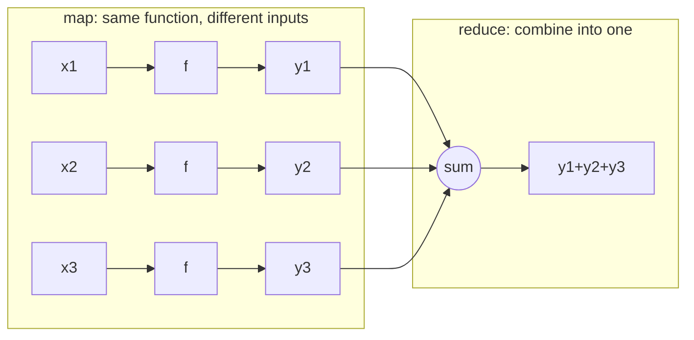
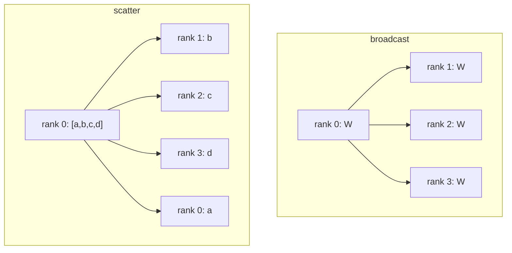
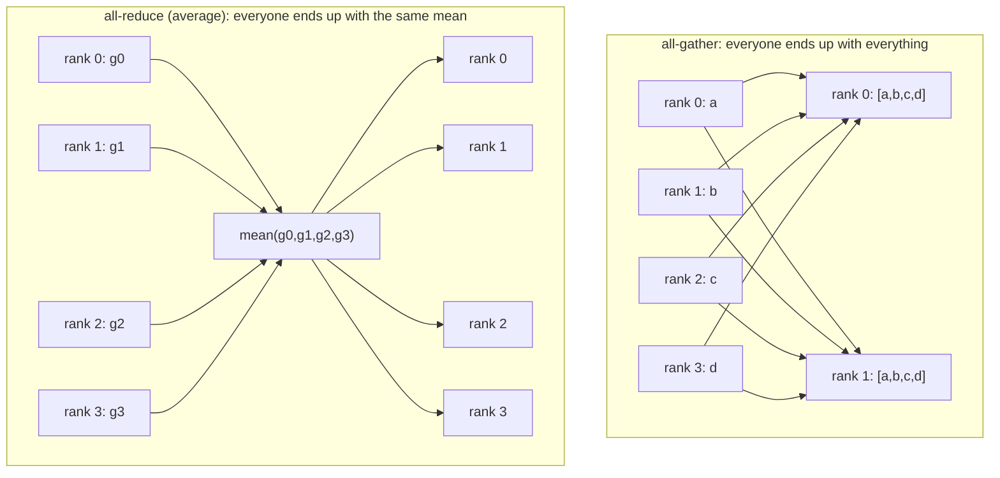
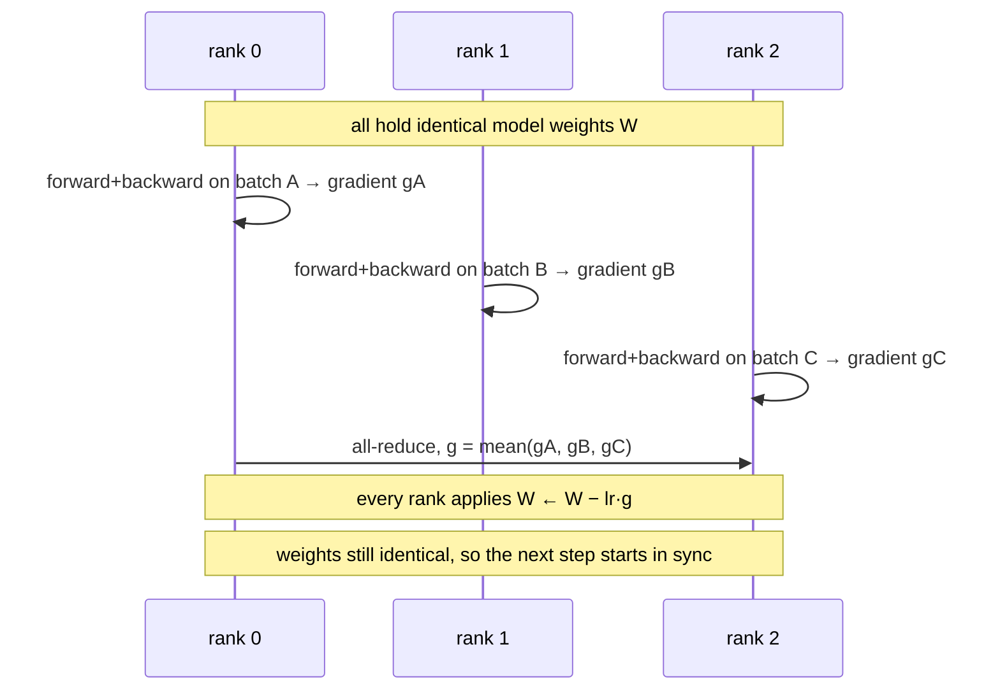
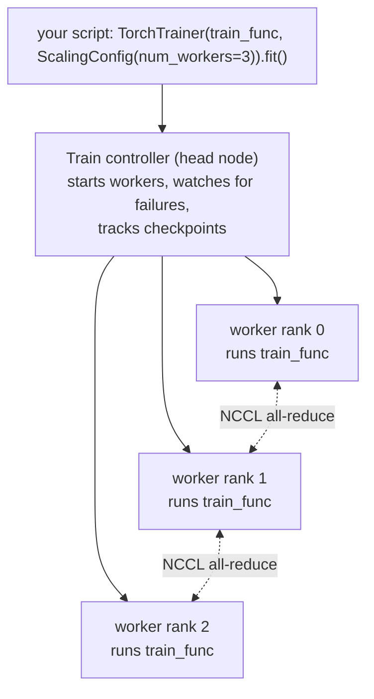
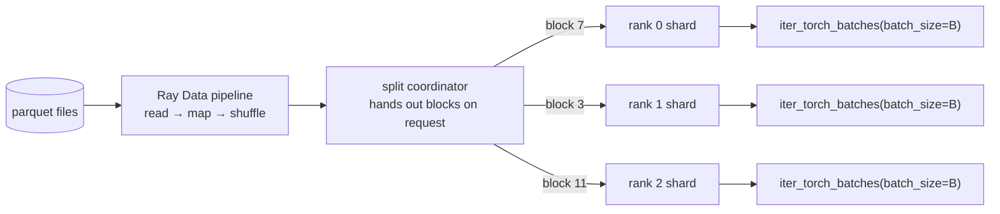
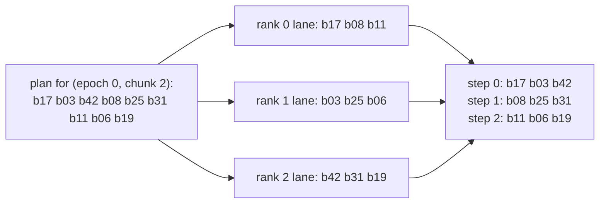
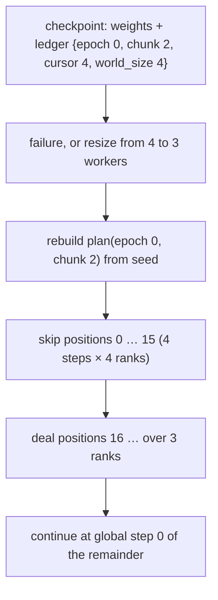

# An introduction to distributed training with Ray, and how distrainer does it

This is a plain-language tour. It starts from zero, introduces each term the first time it is used, and ends with how distrainer's design differs from what Ray and Anyscale give you out of the box. If you already know what DDP and an all-reduce are, skip to [Part 4](#part-4-ray-train-and-pytorch).

## Part 1: Why train on more than one machine

Training a neural network means repeating one loop millions of times: take a small batch of examples, run them through the model, measure how wrong the model was, nudge the model's weights so it is a little less wrong, repeat. A **batch** is the handful of examples processed in one nudge; a **step** is one trip through the loop; an **epoch** is one full pass over all of the training data.

A single GPU can only hold so much and only go so fast. If you want to train faster, or on more data, you use several GPUs, often spread across several computers. Each computer is called a **node**. Each running copy of your training program is a **worker**. With four nodes of one GPU each you have four workers. The set of all workers is the **world**, and each worker has a number from `0` to `world_size - 1` called its **rank**. Rank 0 usually gets a few extra jobs, such as saving files, so you do not save four copies.

The moment there is more than one worker you have to answer two questions:

1. **Who works on which data?** If all four workers process the same batch, you have done nothing useful.
2. **How do the workers agree on the model?** Each worker nudges its own copy of the weights. If they never talk, you end up with four different models.

Everything in distributed training is an answer to those two questions.

## Part 2: The vocabulary of parallel programs

Before looking at training specifically, here are the handful of communication patterns every parallel program is built from. The names come from the message-passing world (MPI) and PyTorch uses the same ones.

**Map** — apply the same function to many pieces of data independently. No communication needed. "Resize every image in this folder" is a map.

**Reduce** — combine many values into one with an operation like sum or max. "Add up the word counts from every file" is a reduce. Map followed by reduce is the MapReduce pattern that big-data systems are built on.

The next four are **collectives**: operations that every worker in the world participates in at the same time. A collective is also a meeting point; no worker can finish it until all of them have arrived. This is what people mean by a **barrier**.

**Broadcast** — one worker sends the same value to everyone. Used to copy the initial model weights from rank 0 to all ranks so everyone starts identical.

**Scatter** — one worker splits a list and sends piece *i* to rank *i*. Everyone gets a different slice.

**Gather** — the reverse of scatter: every worker sends its piece to one worker, which assembles the list.

**All-gather** — like gather, but *every* worker ends up with the full assembled list, not just one of them.

**All-reduce** — every worker contributes a value, they are reduced (say, averaged), and *every* worker receives the result. This is the single most important collective in training.

Two practical facts about collectives matter for what follows. First, they are only fast on GPUs because of special libraries (NCCL on NVIDIA hardware) that move data directly between GPUs. Second, because a collective is a barrier, every rank must call it the same number of times and in the same order, or the program hangs forever. That rule will show up again when we talk about checkpoints.

## Part 3: Data-parallel training (DDP)

The most common way to use many workers is **data parallelism**: every worker holds a complete copy of the model, each worker gets a *different* batch, and after computing its gradients (the "which way to nudge" vector) the workers **all-reduce** the gradients so everyone applies the same averaged update. Because everyone started identical and applies identical updates, the copies stay identical. PyTorch's implementation is called **DistributedDataParallel**, or **DDP**.

The two questions from Part 1 are answered like this: *who works on which data* is solved by giving each rank a different slice, its **shard**, and *how the workers agree* is solved by the all-reduce. The effective batch size is the per-worker batch times the world size, which is why learning rates are usually scaled when you add workers.

Three other patterns exist and are worth knowing by name, though distrainer v0.1 focuses on data parallelism. **Model parallelism** splits one model's layers across GPUs when it does not fit on one. **Fully Sharded Data Parallel (FSDP)** keeps data parallelism but *shards* the weights and optimizer state across workers to save memory, gathering each layer's weights just in time with an all-gather. **Pipeline parallelism** turns the layers into an assembly line. All of them still need a per-rank data shard, so everything said below about data applies to them too.

## Part 4: Ray Train and PyTorch

**Ray** is a system for running Python across a cluster. You start a **head node** and any number of worker nodes, and Ray lets you launch functions (**tasks**) and long-lived objects (**actors**) anywhere in the cluster while it handles scheduling and moving data between nodes. **Ray Train** is the library on top of Ray for distributed training; **Ray Data** is the library for loading and transforming data. Anyscale is the company behind Ray and sells a hosted version with extras (Part 7).

Ray Train's shape is simple. You write one Python function, the **training function**, that contains your normal PyTorch loop. Ray Train starts a **controller** process on the head node, the controller launches one worker actor per rank (each with one GPU), and every worker runs your training function. Ray Train sets up the process group so PyTorch's collectives work, and gives you a few helpers inside the function.

The helpers you use inside the training function:

- `ray.train.torch.prepare_model(model)` wraps your model in DDP and moves it to the right GPU.
- `ray.train.get_dataset_shard("train")` hands this rank its slice of the data (Part 5). If you prefer a plain PyTorch `DataLoader`, `prepare_data_loader` adds the sampler that makes each rank see a different slice.
- `ray.train.report(metrics, checkpoint=...)` sends metrics to the controller and, optionally, saves a **checkpoint**: a folder with the model weights and whatever else you need to continue later. `report` is a barrier, so every rank must call it the same number of times.
- `ray.train.get_checkpoint()` returns the latest checkpoint when the run is restarting after a failure, so you can load it and continue.

Outside the function, `ScalingConfig` says how many workers and whether they use GPUs, `RunConfig` says where checkpoints go (a local folder, S3, or any S3-compatible store), and `FailureConfig` says how many times to retry after a failure. Retrying means: throw away all workers, start new ones, call the training function again, and let it load the latest checkpoint.

## Part 5: How data loading works in Ray

Ray Data represents a dataset as a list of **blocks**, each a table of a few thousand rows stored in Ray's shared memory. Reading files, filtering, and transforming are maps over blocks, run as Ray tasks across the cluster, streamed rather than loaded all at once.

When you hand a dataset to Ray Train, it is **split** across workers: rank *i* gets `1/world_size` of it. The important thing to understand is *how*. The split is dynamic. A single coordinator runs the dataset pipeline and hands each finished block to whichever worker asks next, preferring a worker on the same node as the block so less data crosses the network. So a worker's shard is not "rows 0 to 25 percent"; it is "whichever blocks this worker happened to pull this time". The coordinator also equalizes the row counts so every rank takes the same number of steps, dropping a few leftover rows if needed.

Inside the training function, `shard.iter_torch_batches(batch_size=B)` walks the incoming blocks and slices them into batches of `B` rows, prefetching in the background. When your loop finishes the shard and starts again, that is a new epoch: all ranks wait at a barrier, and the whole pipeline re-executes from the files. This is why expensive preprocessing should be done once and stored, with only cheap per-epoch work such as shuffling left in the pipeline.

Note what is *not* here: there is no notion of "which batch am I on" that survives a restart. If a worker dies at step 3,000 of a 10,000-step epoch and Ray restarts the run from a checkpoint, the pipeline re-executes and the shard starts from the beginning of the epoch. The model weights come back from the checkpoint; the data position does not.

## Part 6: Checkpoints, failures, and elasticity

A checkpoint is the run's save game. Ray Train writes it wherever `RunConfig` points, keeps the last few, and, when any worker fails, restarts all workers and hands the newest checkpoint back. Node failures and **preemption** (a cloud provider taking back a cheap "spot" machine) are handled the same way.

Ray Train can also be **elastic**: you say "between 2 and 8 workers", the run starts as soon as 2 are available, and when more machines join or some leave, the controller restarts the workers at the new size from the latest checkpoint. That is powerful but it makes the data-position problem worse: if you had 4 workers and now have 3, a saved "rank 2 was at step 3,000" no longer means anything, because the data is re-split three ways.

So the honest summary of open-source Ray is: excellent at restarting the *model*, silent about restarting the *data*. You either accept that a restart repeats part of an epoch, or you build something.

## Part 7: What Anyscale adds

Anyscale's hosted runtime adds features on top of open-source Ray. For training, the relevant ones are:

- **Mid-epoch resumption.** Every row gets a unique id column, the runtime records which ids each worker has consumed, and on restart the dataset skips them. The training function saves `shard.state_dict()` next to the model and passes it back on restart. It only works for pipelines made of simple per-row transformations (no shuffles or joins in the middle), needs shared storage for its bookkeeping, and is a beta feature.
- **A training dashboard** with per-worker logs, progress, error attribution, and profiling; logs kept for 30 days.
- **Cluster-level handling of spot preemption**, job queues, priority scheduling, and alerting.

Elastic training used to be on this list; it is now in open-source Ray Train as well. The one that matters for the "where was I in the data" problem is mid-epoch resumption, and that is the gap distrainer fills, in a different way.

## Part 8: How distrainer works

distrainer keeps Ray Train for everything it is good at (launching workers, process groups, checkpoints, retries, elasticity, S3 storage) and replaces one thing: how data reaches the workers. The idea is to make a **block** the unit of everything, so that progress is simply "how many blocks are done", a number that does not care how many workers there are.

### The block

In distrainer a block is a pre-built batch of rows with a stable name, its `block_id`, stored as one Parquet file in a **block store** (a folder or an S3 bucket). Blocks are built ahead of time by whatever process you like, typically a Ray Data job. The training loop never sees loose rows; it sees blocks. A block can be exactly one GPU batch, or a larger "super-batch" that the worker cuts into several micro-batches.

### The plan and the lane

For each epoch, and for each **chunk** within the epoch (a chunk is just a fixed number of blocks; it is the sub-epoch unit), a **planner** produces an ordered list of block ids. Shuffling is a seeded permutation of that list, so it can be recreated exactly from `(seed, epoch, chunk)`. Blocks are then dealt to ranks like cards: position `i` in the plan goes to rank `i mod world_size`, at step `i div world_size`. Each rank's cards are its **lane**, and it loads them itself from the block store with a small prefetching loader. There is no coordinator and no lockstep; the only meeting point is `report`.

### The ledger

Every checkpoint carries a tiny file called the **ledger**: `epoch`, `chunk`, `cursor` (how many global steps of this chunk are done), and `world_size` at the time. Because `report` is a barrier, all ranks are at the same step whenever a checkpoint is written, so a single integer describes the data position for the whole world. Resuming means rebuilding the same plan from the same seed, skipping the first `cursor × world_size` positions, and re-dealing the rest over however many workers there are *now*.

The only data replayed is whatever ran between the last checkpoint and the failure, which you control with the checkpoint cadence. That is the same guarantee Anyscale's mid-epoch resumption gives, without tracking per-row ids, and it survives a change in world size, which per-rank iterator state does not.

### The checkpoint policy

Because progress is counted in blocks, "when to checkpoint" becomes a plain rule over block indices: every K steps, at the end of each chunk, at the end of each epoch, or a time budget. Rules based on indices need no communication at all; every rank computes the same answer. A time-based rule is decided by rank 0 and broadcast so the ranks agree. Uploads to S3 run in a background thread so frequent checkpoints do not stall training.

### Chunk hooks

The end of a chunk is a natural place to do sub-epoch work. distrainer lets rank 0 run a hook there, for example: embed the whole corpus with the current model, find new hard examples, write a fresh set of blocks for the next chunk. The planner picks them up, and the ledger keeps counting.

## Part 9: Why this is a better fit than Anyscale's approach (for designed-batch training)

Anyscale solves the resume problem by recording every row id that was consumed and filtering them out on restart. distrainer solves it by making the data assignment deterministic in the first place, so the position is a single number. The consequences:

- **World-size independence.** A change from 4 to 3 workers is a re-deal, not a special case. Anyscale's row-id approach also handles this, but per-rank iterator state in general does not.
- **Nothing to track at row level.** No id column requirement, no sidecar bookkeeping on shared storage, no restriction to map-only pipelines. The pipeline can do anything it likes, because it runs *before* blocks are written.
- **Batch composition is yours.** A block is a batch you designed. Contrastive training with hard negatives, curriculum ordering, mixing several datasets in a chosen ratio, all become "what the planner emits", not "what the shuffle happened to produce".
- **Shuffling is at block level and reproducible.** Two runs with the same seed consume identical block sequences per rank.
- **It runs on open-source Ray**, on a laptop, in Docker, or on Kubernetes, and stores blocks and checkpoints on any S3-compatible service.

The trade-off is that data must be pre-blocked. If your training set is a live streaming pipeline with a global shuffle in the middle, Ray Data's streaming split is the better tool and Anyscale's row tracking is the way to resume it. For workloads where you *want* to control what is in a batch, pre-blocking is not a cost; it is the point.

## Part 10: What the block abstraction makes possible

Because every rank consumes "one block per global step" and nothing else is assumed about the block's contents, the same machinery supports many training styles by changing only what a block holds and what `train_step` does with it.

**Plain DDP.** A block is a batch; `train_step` does forward, backward, and lets DDP all-reduce the gradients. This is the default.

**Gradient accumulation.** A block holds several micro-batches; `train_step` loops over them, accumulating gradients, and steps the optimizer once. Checkpoint accounting stays per block.

**Contrastive learning with hard negatives.** A block holds anchors, positives, and the hard negatives mined for them. In-block negatives cost no communication. If you also want negatives from other ranks, `train_step` does an all-gather of embeddings across the world, and the planner can place related blocks at adjacent plan positions so they land in the same global step.

**Curriculum learning.** The planner orders blocks from easy to hard instead of shuffling uniformly.

**Multi-dataset mixing.** The planner interleaves blocks from several namespaces in a chosen ratio; the ledger does not care where a block came from.

**FSDP and other sharded-model schemes.** The data side is unchanged: one block per rank per step. Each rank reports its own checkpoint shard and Ray Train merges them into one checkpoint folder, and the ledger rides along.

**Evaluation blocks.** A block flagged as evaluation is run without gradients; the same lane loader serves it.

**Elastic and spot-instance training.** Any of the above, with `num_workers=(min, max)`; a resize is a re-deal.

## Glossary

- **Batch / step / epoch** — examples per update; one update; one pass over the data.
- **Node, worker, rank, world size** — a machine; a running copy of the program; its number; how many there are.
- **Map, reduce** — apply a function to many items; combine many values into one.
- **Broadcast, scatter, gather, all-gather, all-reduce** — the collective communication patterns (Part 2).
- **Barrier** — a point every rank must reach before any can continue; every collective is one.
- **DDP** — data-parallel training with full model copies and gradient all-reduce.
- **FSDP** — data parallelism with model weights sharded across ranks.
- **Ray, Ray Train, Ray Data** — cluster runtime; its training library; its data library.
- **Controller** — Ray Train's process on the head node that launches workers and tracks checkpoints.
- **Shard** — a rank's slice of the data.
- **Checkpoint** — a saved folder of weights and state used to resume.
- **Elastic training** — a run whose number of workers can change while it runs.
- **Preemption** — a cloud provider reclaiming a spot machine.
- **Block (Ray Data)** — a few thousand rows in shared memory, the unit Ray Data streams.
- **Block (distrainer)** — a pre-built, named batch stored as a Parquet file.
- **Chunk** — a fixed number of blocks; the sub-epoch unit where hooks and re-shuffles happen.
- **Plan, lane** — the ordered block list for a chunk; one rank's share of it.
- **Ledger, cursor** — the data position stored in a checkpoint; the number of completed global steps.
- **Checkpoint policy** — the rule that decides at which block boundaries to save.
- **Chunk hook** — code that rank 0 runs at the end of a chunk, e.g. re-mining hard negatives.
