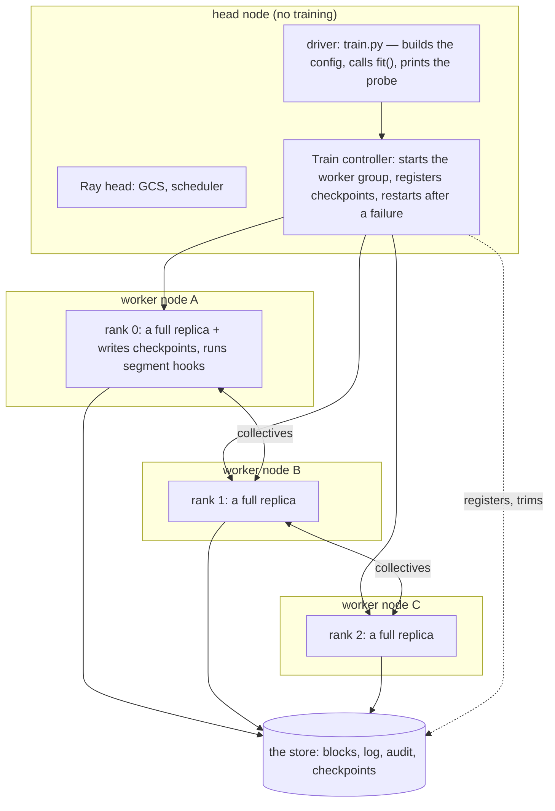
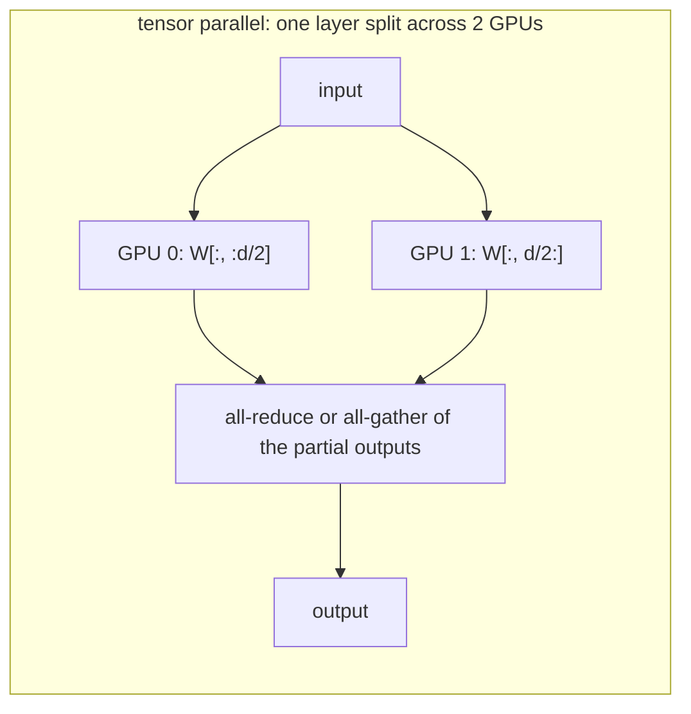
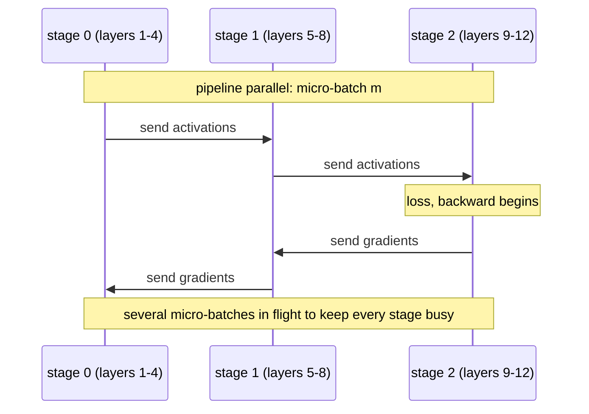
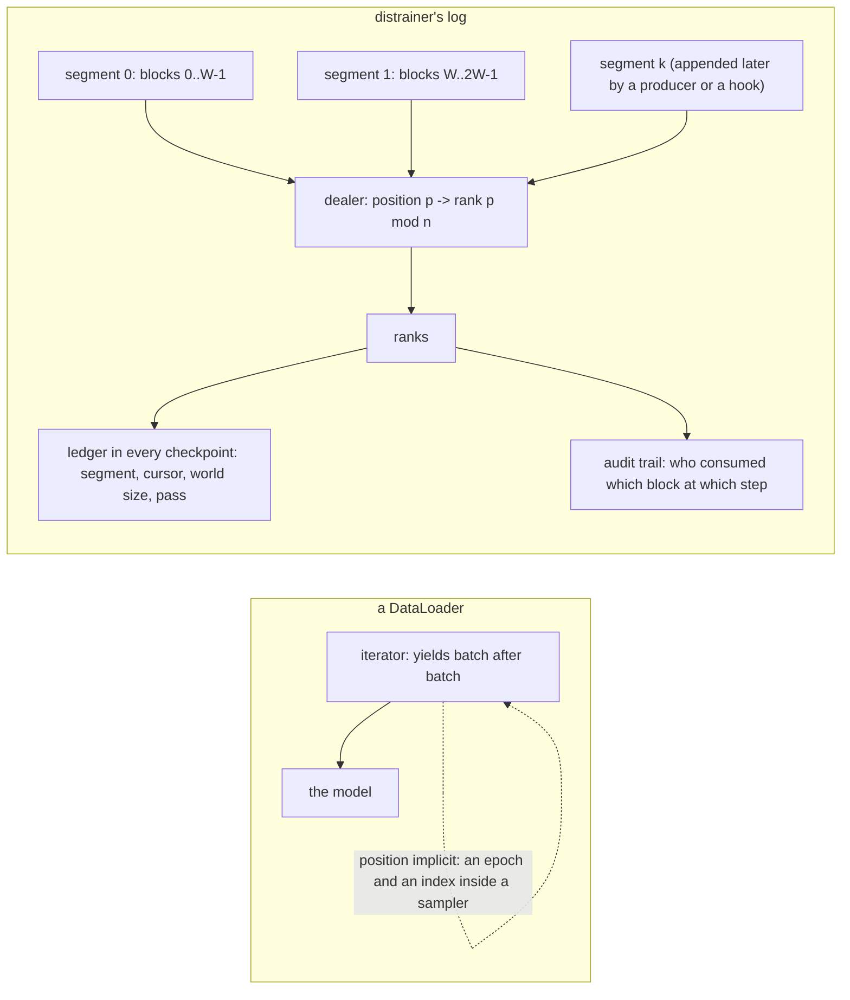

# Parallel training, in terms of the collectives, and where distrainer fits

Second of two pages: `docs/collectives.md` defines the primitives (barrier, broadcast,
all-reduce, all-gather, reduce-scatter, send and receive) and shows where distrainer's loop
uses them. This page explains the kinds of parallel training with those words, says what the
head node and rank 0 are for, shows how PyTorch's DDP and FSDP are built on the primitives and
how they sit inside distrainer, and ends with what makes the block log a good data layer for
some of these trainings and not for others.

## 1. Who is who: the head, the driver, the ranks, and rank 0



- The **head** runs Ray's control plane and the Train controller. It never holds the model.
  It decides *that* a worker group of `n` exists, restarts it after a node dies, resizes it
  when the elastic monitor sees more or fewer resources, and keeps the list of checkpoints
  (`num_to_keep`). In distrainer the driver script also runs there, which is why `exec-head`
  is where `train.py` starts.
- The **ranks** are the worker processes, one per training slot (`trainer: 1` in the
  harness, one GPU each on RunPod). Every rank runs the whole `train_loop`.
- **Rank 0** is one of the ranks with two extra duties, both because *something must be
  written exactly once*: it saves the checkpoint (the replicas are identical after every
  all-reduce, so one copy is the whole truth) and it runs the segment-end hooks that write
  the next segment of a streamed log. It is a leader among equals, not a server: rank 0 does
  the same forward and backward as everyone. Checkpoints do not happen on the head because
  the weights are not there.

## 2. Five kinds of training

Each kind is one step of the loop drawn with its collectives, then what a checkpoint holds
and how a restart or a resize behaves.

### 2.1 One machine

No ranks, no collectives. Section 1 of the primer.

### 2.2 Data parallelism (DDP): replicas, different batches, averaged gradients

```mermaid
sequenceDiagram
  participant R0 as rank 0
  participant R1 as rank 1
  participant R2 as rank 2
  Note over R0,R2: each rank: its own block -> forward -> loss -> backward
  R0->>R1: all-reduce of the gradients (inside backward)
  R1->>R2: ...
  R2->>R0: ...
  Note over R0,R2: identical averaged gradients -> identical optimizer.step
  Note over R0,R2: report (a barrier); rank 0 attaches the checkpoint
```

Every rank holds the full model and optimizer. The batch differs per rank: distrainer deals
block `p` to rank `p mod n`, so a step consumes `n` blocks. The one collective per step is the
all-reduce of the gradients; after it the replicas are identical again, so the optimizer step
needs no communication.

**How PyTorch's `DistributedDataParallel` does it.** Wrapping the model registers an autograd
hook on every parameter. During `backward()`, as soon as a bucket of parameters (a few
megabytes) has its gradients, DDP launches an asynchronous all-reduce of that bucket while the
rest of the backward pass continues; `backward()` returns when every bucket has been reduced
and divided by `n`. Communication overlaps computation, which is why DDP scales well on a fast
link and badly on a slow one (the transatlantic case). `torch.distributed.init_process_group`
sets the group up: rank 0's address as the rendezvous (Ray Train fills it in), the backend
(NCCL for GPUs, Gloo for CPUs), the rank and world size. Ray Train's `prepare_model` is the
wrap; distrainer calls it after `build_model` and never touches DDP again. `torch.no_sync()`
skips the all-reduce for a step, which is the hook local SGD uses (2.5).

**Checkpoint.** `unwrap(model).state_dict()` plus the optimizer state, from rank 0, plus the
ledger. **Restart** with the same `n`: every rank loads the same file. **Resize**: the ledger's
`cursor * world_size_old` is the number of positions done; the remaining positions are
re-dealt over the new `n`; the weights need no change because every replica is the whole
model. This is the training distrainer implements today.

### 2.3 Sharded data parallelism (FSDP, ZeRO): replicas in computation, shards in memory

```mermaid
sequenceDiagram
  participant R0 as rank 0 (shard 0)
  participant R1 as rank 1 (shard 1)
  participant R2 as rank 2 (shard 2)
  Note over R0,R2: for each layer in the forward pass:
  R0->>R2: all-gather the layer's parameters (everyone holds the full layer for a moment)
  Note over R0,R2: compute; free the gathered copy
  Note over R0,R2: for each layer in the backward pass:
  R0->>R2: all-gather the parameters again
  Note over R0,R2: compute the gradients
  R2->>R0: reduce-scatter the gradients (each rank keeps the slice of its shard)
  Note over R0,R2: optimizer.step on the shard only
```

Same data flow as DDP (a different batch per rank, the same weights in effect), but each rank
*stores* only `1/n` of the parameters, gradients and optimizer state. The price is
communication: per layer, an all-gather before use and a reduce-scatter after, about twice
the bytes of DDP's one all-reduce, and a barrier at every layer. The gain is memory: a model
that does not fit on one GPU fits on `n`.

**How PyTorch's FSDP does it.** `FullyShardedDataParallel` (or `fully_shard`) wraps the model
by units (a layer, a block); each unit's flat parameter is split across the group. Hooks before
a unit's forward all-gather it, hooks after free it; hooks in backward all-gather again,
compute, and reduce-scatter. Mixed precision keeps the shard in fp32 and the gathered copy in
bf16. The optimizer sees only local shards. ZeRO (DeepSpeed) is the same idea in stages
(optimizer state, then gradients, then parameters).

**Checkpoint.** Two shapes: a *full* state dict gathered to rank 0 (simple, one file, costs one
all-gather of everything) or a *sharded* one where every rank writes its shard
(`torch.distributed.checkpoint`, fast, `n` files). **Restart** with the same `n`: each rank
reads its shard. **Resize**: the shards must be re-cut for the new `n`; the sharded format
supports it at load time, the full one trivially. The data side is DDP's: the same dealing,
the same ledger.

### 2.4 Tensor and pipeline parallelism: one replica across several devices





**Tensor parallelism** splits the matrices of one layer across GPUs; every layer's forward and
backward ends with an all-reduce (or all-gather) of activations, so it is a collective *per
layer per micro-batch* and only makes sense over NVLink inside a machine. **Pipeline
parallelism** splits the layers into stages and sends activations and gradients between
neighbours; micro-batches keep the stages busy, and the "bubble" at the start and end of each
step is the price. Both are ways of making *one* replica out of several devices; data
parallelism then runs across such groups. Sequence parallelism (long sequences split across
devices) and expert parallelism (mixture-of-experts layers spread across devices) are of the
same family: inside the model, per layer.

**Checkpoint.** Sharded by layer and by tensor slice; a resize of the tensor-parallel degree
means re-cutting every weight. **Restart** on the same layout is routine; a **resize** is a
conversion, not a re-deal.

### 2.5 Local SGD and DiLoCo: sync rarely, on purpose

```mermaid
sequenceDiagram
  participant R0 as rank 0
  participant R1 as rank 1
  participant R2 as rank 2
  Note over R0,R2: H steps each, no collective at all (DDP's all-reduce off)
  Note over R0,R2: the replicas drift apart a little
  R0->>R2: all-reduce of the parameters (or of the change since the last sync)
  Note over R0,R2: everyone holds the average; DiLoCo feeds the change to an outer optimizer
  Note over R0,R2: H more steps ...
```

Each rank trains alone for `H` steps (hundreds), then the ranks average their weights, or,
in DiLoCo, average the *change* since the last sync and apply it with an outer optimizer
(Nesterov momentum) on every rank. One collective every `H` steps instead of one per step:
the link between ranks can be slow (the transatlantic pods again), the ranks can even be in
different data centers, and a rank that arrives late only delays the sync. The cost is
statistical (the average of drifted replicas is not the replica of the average), which the
outer optimizer and a small `H` keep in check.

**Checkpoint.** Rank 0's weights after a sync plus the outer optimizer state. **Restart**:
every rank loads the synced weights. **Resize**: at a sync point the new ranks join with the
averaged weights; nothing else changes.

## 3. What in distrainer makes it a good fit, and for what

distrainer owns the *data axis* of training and nothing inside the model:

- the **log**: immutable segments of `W` blocks, each block a Parquet file, committed
  atomically, with a pass index;
- the **dealer**: position `p` goes to rank `p mod n` at step `p // n` of its segment; `W` is
  a multiple of every allowed `n`;
- the **ledger** `(segment, cursor, world_size, pass)` in every checkpoint, four integers that
  say exactly which positions are done, so a resume over any `n` re-deals the rest;
- the **segment end**: a barrier where rank 0 may write the next segment (hooks) and the
  loop may run retention gc;
- the **audit trail**: every rank appends `(attempt, world size, segment, cursor, position,
  block)` per step, so a checker can prove what was consumed after any kill or resize.

| training | fit | why, and what would be better |
|---|---|---|
| DDP | built | the dealer *is* data parallelism; the resize is a re-deal; the checkpoint is one file from rank 0 |
| FSDP / ZeRO | a `build_model` change plus sharded checkpoints | the data side is DDP's; `CheckpointIO` must write one shard per rank and reshard on a resize; the ledger is unchanged |
| local SGD / DiLoCo | a natural fit | the segment end is already a barrier on every rank: sync there, run the steps in between with the all-reduce off (`no_sync`); the audit and the ledger are unchanged; slow links become tolerable |
| tensor parallel | poor | a distrainer rank would have to become a *group* of devices, the loop would need a device mesh, checkpoints are per-slice, and the elastic resize cannot re-deal a tensor split; use Megatron, NeMo or torchtitan for the model side and, at most, distrainer as the data layer feeding each group |
| pipeline parallel | poor | the same, plus a block would have to be split into micro-batches inside the step; the frameworks above own that schedule |

## 4. The log versus a yielded DataLoader



A `DataLoader` is an iterator: it yields the next batch and forgets it. Its position is
implicit, an epoch counter and an index inside a sampler, so a resume means "skip the first
`k` batches" and hope the sampler is seeded the same way, and a change of world size changes
what every rank sees from then on. Nothing records what was consumed.

The log is a table of segments, appended and never rewritten: a delta table whose rows are
blocks and whose commits are segment files. That gives the trainings above three things a
loader cannot:

- **an explicit position**, so a checkpoint can carry the four-integer ledger and a resume
  re-deals the remaining positions over *any* world size (DDP and FSDP resizes, DiLoCo ranks
  joining at a sync);
- **a barrier with a meaning**: the segment end is the unit of streaming (a producer or the
  re-mining hook appends the next segment) and the natural sync point for local SGD, and
  retention gc keeps the log a window rather than a corpus;
- **a proof**: the audit trail lets a checker verify row-exact resume and elastic resize
  after a kill, which is how every scenario in `docs/examples-and-scenarios.md` is judged.

What it costs is a fixed block size per step (a block is a batch) and the discipline that `W`
is a multiple of every allowed world size. For the model-internal parallelisms it is
neutral: a block is a group's batch, and the group's own machinery splits it.
